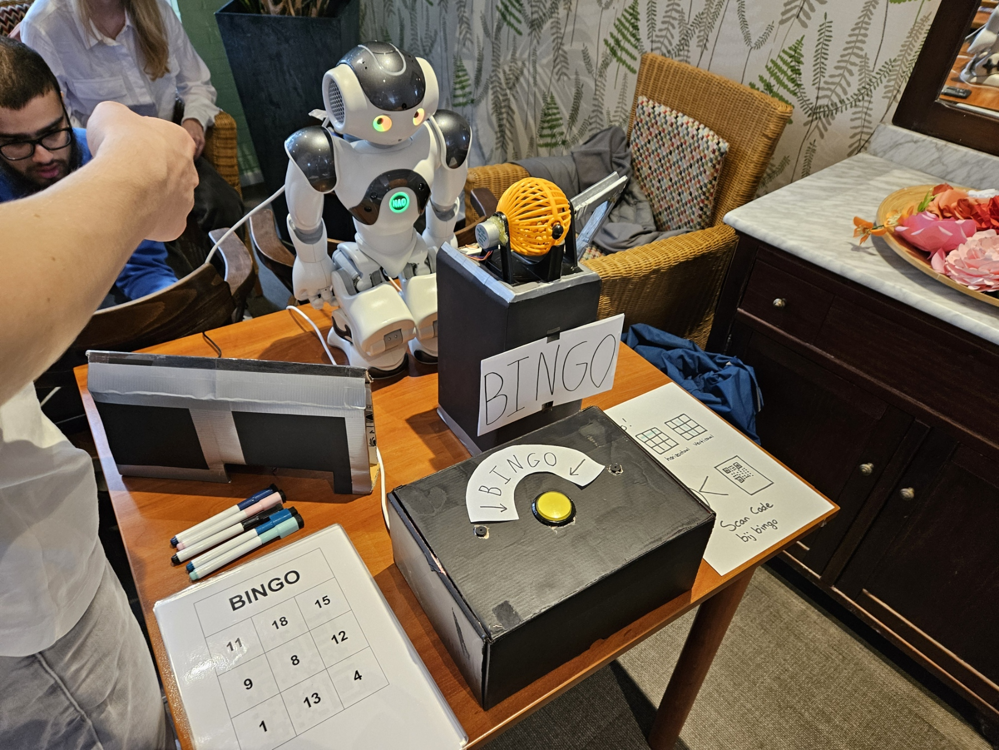
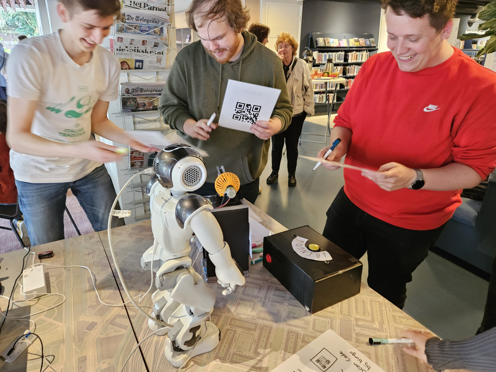
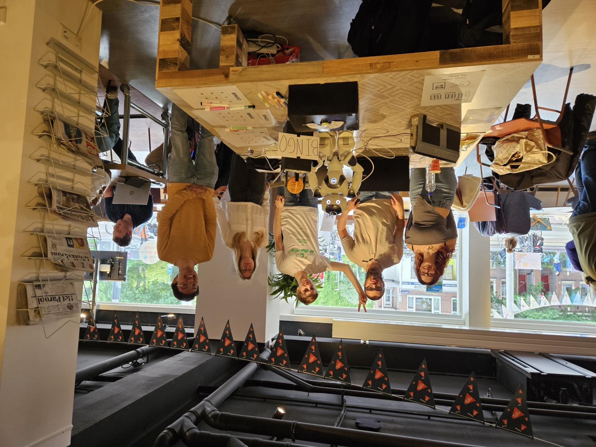

# Bingo game with embedded devices

In this project we wanted to make an interactive bingo game for the elderly in care homes. For this project we used a NAO robot from Aldebaran Robotics and our own custom made (prototype) embedded devices. 

This project consisted of 3 sprints (of 3 weaks each) in which we gradually worked on various aspects of the project following an agile/scrum development trajectory. In this project we worked with computer vision (OpenCV), Python Flask, and MySQL (MariaDB). 

Most of our code was written in Python since the development tools/SDK of the NAO robot only supported Python or C++.

You can find all our code, related project files and documentation inside this repository (https://github.com/almukhabarat/bingo_game_elderly/tree/main).

## Photos of the project:

### All teammembers on the presentation of our final product result

# Extra information about the project

## Purpose

*"When you think of robots, you often imagine a high-tech environment, but robots can also serve educational, caregiving, or entertainment purposes. In this project, you will develop a robotic application for the Amstelhuis or the Neighborhood Campus. The robotic application should have an educational or entertainment aspect and be accessible to people without a technical background."*  
[**-See assignment description**](../opdracht/assignment.md)

### Client Requirements:

- The product must have an educational or entertainment focus.  
- The product must be easily accessible for the elderly.  
- The product must include a physical component.

### Instructor Requirements:

- The product must utilize a database.  
- The product must include an embedded layer.  

---

## Concept

Our idea is to create a **BINGO game** using a NAO robot. The setup will consist of a NAO robot positioned in front of a small table. On the table, there will be a Bingo ball cage that the NAO robot can spin. The NAO will pick up the Bingo balls and announce the number. If someone calls out “Bingo,” the NAO will pause and look at a specific area on the table where the player can place their Bingo card. The NAO will then scan the barcode/QR code on the card and confirm whether the player has won or not.

---

## Storyboard

To make the use of our product easier to explain, we’ve created a storyboard outlining the various tasks being performed.

---

## Implementation

### Connection with Raspberry Pi

To ensure the NAO consistently picks up the Bingo balls, we’ll use an electromagnet that can pick up the metal balls when activated. This electromagnet will be controlled by a Raspberry Pi mounted on the back of the NAO robot. The Raspberry Pi connects to the NAO robot via the **Ethernet port** on the NAO’s back. The Raspberry Pi will receive 5V DC power by connecting to the **USB port** on the NAO’s back.

During feedback from our sprint review, it became clear that an additional embedded hardware component is needed. We will add an **ESP32 S3** to communicate with the Raspberry Pi.

---

### Dispensing Prizes

To make the game more engaging, we plan to dispense prizes when someone wins. This will be done using a candy dispenser connected to the Raspberry Pi.

We’ll use the standard design for a **spiral vending machine**, where a stepper motor delivers candy to the winner. Below is a pinout diagram for this embedded system:

**Components:**
- ESP32 S3  
- USB Charger 5V 2A - Power Adapter 100V-240V  
- Stepper motor 28BYJ-48-5V  
- ULN2003 Stepper Motor Driver Board  

---

### Picking Up Bingo Balls

The NAO’s finger grip isn’t precise enough to pick up Bingo balls. To ensure consistent handling, we’ll use an electromagnet.  
**Note: The Bingo balls must be ferromagnetic.** The electromagnet will be mounted in the NAO’s left or right hand using a 3D-printed attachment.

---

### Scanning Bingo Cards

To verify if a player has Bingo, the NAO must be able to read the Bingo card.

#### Options Considered:

1. Scanning Bingo numbers directly  
2. Scanning a barcode at the bottom of the card  
3. Scanning a QR code on the back of the card  
4. Using an honor system  

The best option is to scan a **barcode** placed at the bottom of the card. This avoids the need for the NAO to decipher the card using an algorithm. The honor system is not viable because players may make mistakes.  
The Bingo card must be placed in a **specific spot** on the table for scanning.  

---

### Bill of Materials

The setup will include the following materials. Here’s our preliminary Bill of Materials (BOM):  

>**Note:** This BOM does not yet include exact specifications for various materials.  

- NAO robot  
- Bingo ball cage  
- Metal (Bingo) balls  
- Raspberry Pi 4 (Model B)  
- Bingo cards (with barcode/QR code)  
- Electromagnet  
- Ethernet cable  
- USB to Raspberry Pi barrel jack 5V DC power cable  

---

### Database

The Raspberry Pi will host a database, ensuring that the NAO doesn’t require an internet connection to perform its tasks.

**We’ve considered two options for the database:**
1. A database on the Raspberry Pi to store Bingo cards and numbers.  
2. A database on the Raspberry Pi to store scores.  

See [link](../database/database_erd_concept.md) for the ERD concept of option 2.

---

## Possible Additions

To anticipate potential challenges, we’ve brainstormed optional changes to the product in case we have extra or limited time. This ensures that a **minimum viable product** will always be delivered.

### Additions:
- A screen next to the NAO displaying the current Bingo number.  
- An 8-segment display next to the NAO for the current Bingo number.  
- On/Off button for the NAO robot and embedded hardware.  
- Extra speakers for the NAO.

---

## Possible Constraints

- Replacing verbal Bingo calls with a button press might be possible.  

