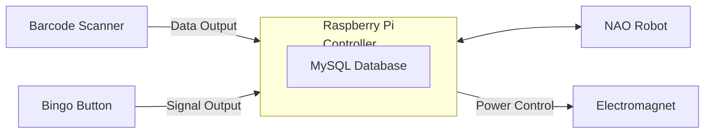

# Sequence diagram

 Dit is een sequence diagram voor de verbindning van de Pi (database) met de nao robot en de pi, met de barcode, de bingo button en de electromagnet.  

```mermaid

flowchart LR
    subgraph RaspberryPi["Raspberry Pi\nController"]
        MySQL["MySQL Database"]
    end

    RaspberryPi <--> NAO_Robot
    RaspberryPi -->|Power Control| Electromagnet
    BarcodeScanner -->|Data Output| RaspberryPi
    BingoButton -->|Signal Output| RaspberryPi

    NAO_Robot["NAO Robot"]
    Electromagnet["Electromagnet"]
    BarcodeScanner["Barcode Scanner"]
    BingoButton["Bingo Button"]

```