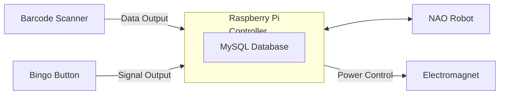
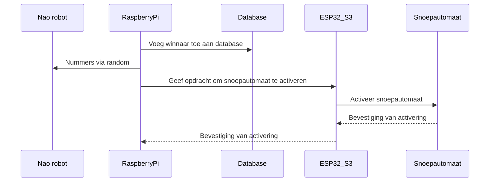

# Sequence diagram

 Dit is een sequence diagram voor de verbinding van de Pi (database) met de nao robot en de pi, met de barcode, de bingo button en een electromagneet.  

    Sequence diagram, pi,database,esp,snoepautomaat
