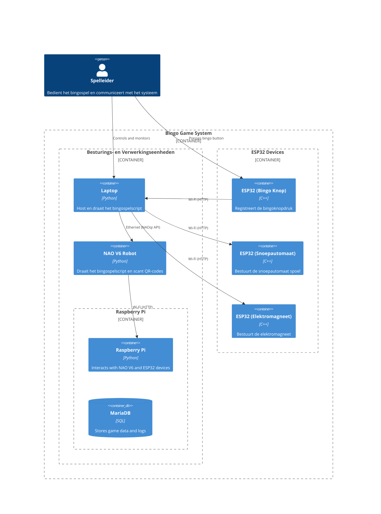
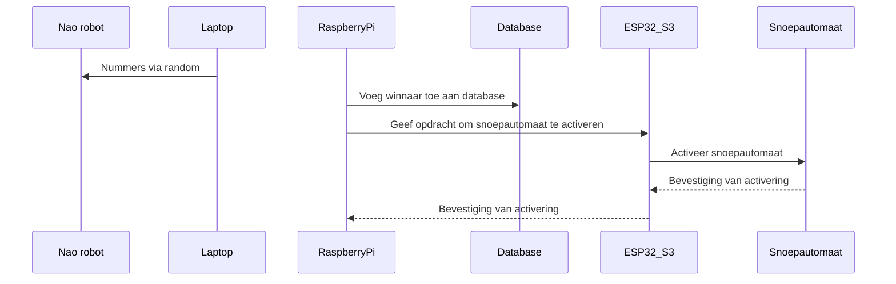

# System Context Diagram
Dit C4-diagram toont de architectuur van het Bingo Game Systeem, met de belangrijkste componenten en hun interacties. Het diagram illustreert de communicatie en protocollen tussen deze componenten.

## Sequence diagram, pi,database,esp,snoepautomaat
