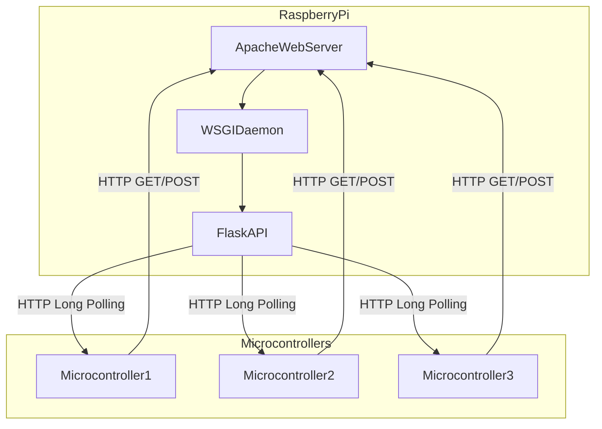
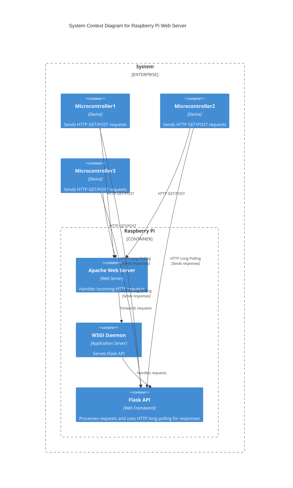

```mermaid
graph TD
  subgraph RaspberryPi
    ApacheWebServer
    WSGIDaemon
    FlaskAPI
  end

  subgraph Microcontrollers
    Microcontroller1
    Microcontroller2
    Microcontroller3
  end

  Microcontroller1 -->|HTTP GET/POST| ApacheWebServer
  Microcontroller2 -->|HTTP GET/POST| ApacheWebServer
  Microcontroller3 -->|HTTP GET/POST| ApacheWebServer
  ApacheWebServer --> WSGIDaemon
  WSGIDaemon --> FlaskAPI
  FlaskAPI -->|HTTP Long Polling| Microcontroller1
  FlaskAPI -->|HTTP Long Polling| Microcontroller2
  FlaskAPI -->|HTTP Long Polling| Microcontroller3
```

```mermaid
%%{init: {'theme': 'base', 'themeVariables': { 'primaryColor': '#ffcc00', 'edgeLabelBackground':'#ffffff', 'tertiaryColor': '#ffcc00'}}}%%
C4Container
    title System Context Diagram for Raspberry Pi Web Server

    Enterprise_Boundary(b0, "System") {
        Container(c1, "Microcontroller1", "Device", "Sends HTTP GET/POST requests")
        Container(c2, "Microcontroller2", "Device", "Sends HTTP GET/POST requests")
        Container(c3, "Microcontroller3", "Device", "Sends HTTP GET/POST requests")
        
        Container_Boundary(c0, "Raspberry Pi") {
            Container(c4, "Apache Web Server", "Web Server", "Handles incoming HTTP requests")
            Container(c5, "WSGI Daemon", "Application Server", "Serves Flask API")
            Container(c6, "Flask API", "Web Framework", "Processes requests and uses HTTP long polling for responses")
        }
    }

    Rel(c1, c4, "HTTP GET/POST")
    Rel(c2, c4, "HTTP GET/POST")
    Rel(c3, c4, "HTTP GET/POST")
    Rel(c4, c5, "Forwards requests")
    Rel(c5, c6, "Handles requests")
    Rel_Back(c6, c1, "HTTP Long Polling", "Sends responses")
    Rel_Back(c6, c2, "HTTP Long Polling", "Sends responses")
    Rel_Back(c6, c3, "HTTP Long Polling", "Sends responses")

```