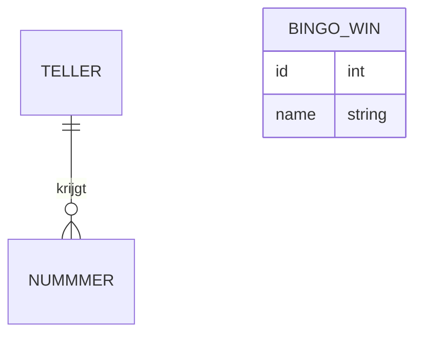

Voor dit project willen we een database opzetten waarin scores worden opgeslagen en verdeeld.

```mermaid
    erDiagram
        TELLER ||--o{ NUMMMER : krijgt
        BINGO_WIN {
            id int
            name string
        }

```
