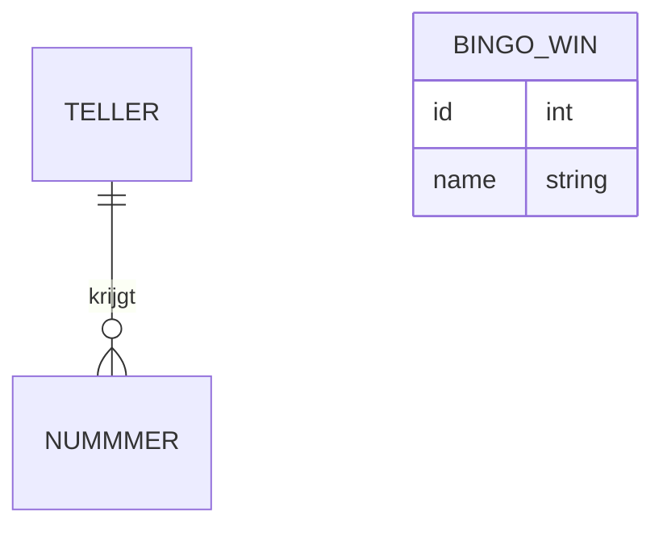

Ons originele idee bevat een database waarin scores worden opgeslagen en verdeeld.

Ons huidige idee bevat een database die de Bingo-nummers zal opslaan zodat de NAO weet welke nummers al zijn opgenoemd.
