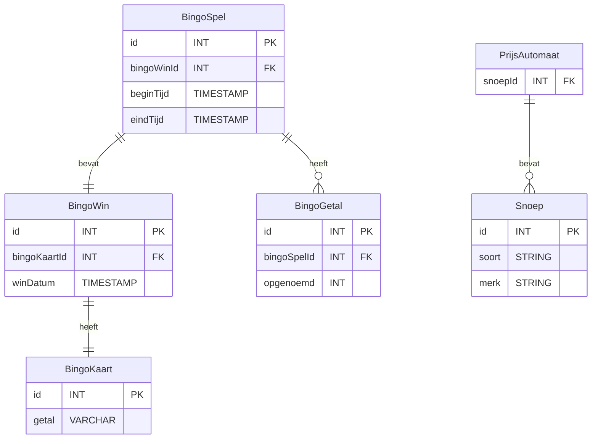

# ERD Concept

Qr code bevat bingo getallen >>> 

Nao6 krijgt getallen van raspi en noemt deze op >>> 

Raspberry Pi genereert getallen (van bijvoorbeeld 1 tot 50) >>>

Een database moet opslaan welke getallen al zijn omgeroepen en welke niet >>>

Een database kan weten hoe vaak een bingo al is omgeroepen en eventueel om welke getal combinaties het gaat >>>

## v2

Idee 1 

Apart tabel maken voor bingokaart nummers

## v3

