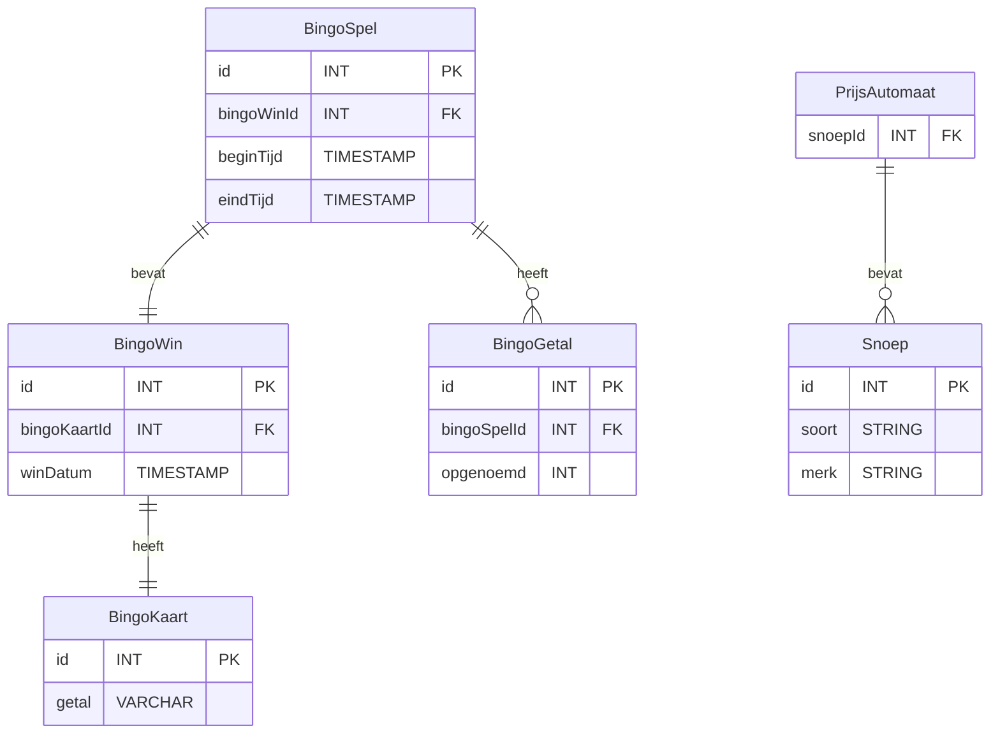

# ERD Concept

Qr code bevat bingo getallen >>> 

Nao6 krijgt getallen van raspi en noemt deze op >>> 

Raspberry Pi genereert getallen (van bijvoorbeeld 1 tot 50) >>>

Een database moet opslaan welke getallen al zijn omgeroepen en welke niet >>>

Een database kan weten hoe vaak een bingo al is omgeroepen en eventueel om welke getal combinaties het gaat >>>

## v2

Idee 1 

Apart tabel maken voor bingokaart nummers

## ERD / Huidige database ontwerp 

### Database ontwerp uitgewerkt in SQL | sprint 3

Dit is uiteindelijk het database ontwerp dat we hebben geïmplementeerd. Zodra het spel begint wordt er eerst een nieuwe BingSpelId aangemaakt waar later de omgeroepen getallen aan worden gekoppelt. 

In het BingoGetal tabel worden de omgeroepen nummers opgeslagen die gekoppelt zijn aan een BingSpelId. Hiermee kan men waarnemen wel getallen in welke volgorde waren omgeroepen per bingo ronde.

Tenslotte wordt er een winId gekoppelt aan de bijbehorende spelId.

We hebben als concept ook nog een prijsautomaat tabel met een snoep tabel toegevoegd als concept van wat we nog konden implementeren in de database.