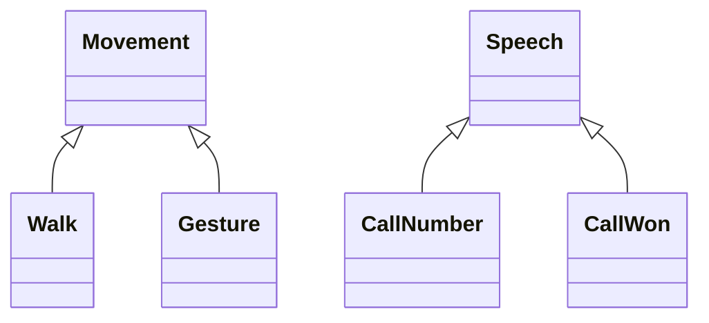

# UML diagram NAO6

We gaan de robot programmeren in Python. Het is nog een concept waar we kunnen onze classes ongeveer zo indelen.

```mermaid
    classDiagram
        Movement <|-- Walk
        Movement <|-- Gesture

        Speech <|-- CallNumber
        Speech <|-- CallWon

        class Movement {
            
        }

        class Walk {

        }

        class Gesture {

        }

        class Speech {

        }

        class CallNumber {

        }

        class CallWon {

        }
```
