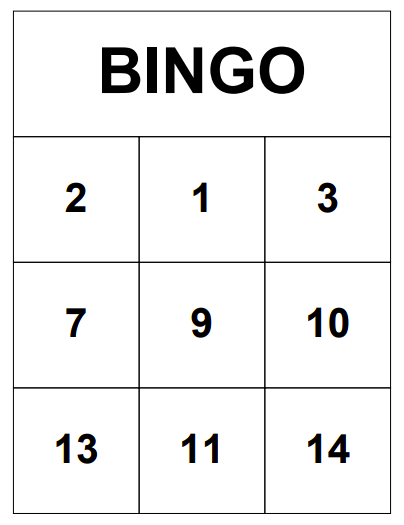

# Bingokaarten

Voor het spelen van de bingo, zijn er natuurlijk bingokaarten nodig.



Wij hebben ervoor gekozen om de kaarten 3 bij 3 vakjes te maken, zodat het spel niet te lang duurt.
De kaarten worden uitgeprint op papier en daarna gelamineerd. Op deze manier kunnen de kaarten hergebruikt worden door er met whiteboardmarker op te schrijven.

Op de achterkant staat een qr code, als deze gescant word door de nao robot, kan deze zien welke nummers er op de kaart staan.

De bingokaarten worden gegenereerd met een python script.

In het script kan aangepast worden hoeveel kaarten er moeten worden gegenereerd. Ook kan de hoeveelheid getallen aangepast worden.

Met de functie play_bingo kunnen de variabelen voor de grid en het aantal kaarten aangepast worden. De functie roept de functie generate_card op, die de nummers voor de kaart in een array zet.

``` py
# Play bingo with a given number of cards, main function
def play_bingo(grid_size, num_cards):
    cards = [generate_card(grid_size) for i in range(num_cards)]
    for i, card in enumerate(cards):
        print(f"Bingo card {i + 1}:")
        for row in card:
            print(' '.join([str(n).rjust(2) for n in row]))
        print("\n")
        
    generate_pdf(cards)
        
# Play bingo with multiple cards
play_bingo(3, 15)

```

