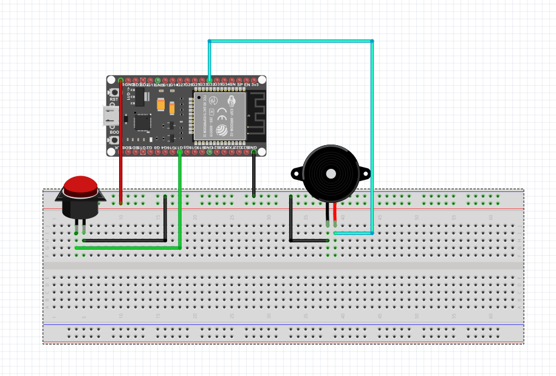

# Bingoknop

Als de kamer waar de nao in staat luidruchtig is, is er de mogelijkheid om op een knop te drukken als er bingo is gehaald.

Zodra er op de knop is gedrukt, zullen buzzers een geluid maken en kan de nao robot gaan kijken of de bingo klopt.

## Onderdelen

Het systeem bestaat uit de volgende onderdelen:
- ESP32-S3
- Knop
- KY-006 Passive buzzer module

## Actieve & Passieve Buzzers

### Verschil tussen Actieve en Passieve Buzzers

**Actieve Buzzers:**
Een actieve buzzer heeft een ingebouwde oscillator die het geluid produceert. Dit betekent dat de buzzer alleen een gelijkstroom (DC) spanning nodig heeft om te werken. Wanneer je een spanning aanlegt, maakt de actieve buzzer een constante toon. 

**Voordelen:**
- Eenvoudig aan te sturen: Alleen een aan/uit-signaal is nodig.
- Geen externe circuits nodig: De oscillator is ingebouwd.
- Betrouwbaar en gemakkelijk te integreren in eenvoudige systemen.

**Nadelen:**
- Beperkte controle over het geluid: Je kunt meestal alleen de aan/uit-status en soms het volume of de toonhoogte veranderen als de buzzer dat ondersteunt.

**Passieve Buzzers:**
Een passieve buzzer heeft geen ingebouwde oscillator en vereist een externe signaalbron om geluid te genereren. Je moet een wisselstroom (AC) of pulserend signaal aanleggen om de buzzer te laten trillen en geluid te maken. 

**Voordelen:**
- Flexibele controle: Je kunt de frequentie, duur en patroon van het geluid nauwkeurig regelen.
- Meerdere tonen en melodieën mogelijk: Je kunt verschillende geluiden programmeren door de frequentie van het signaal te variëren.

**Nadelen:**
- Meer programmering en mogelijk extra hardware nodig.

### Waarom kiezen voor een passieve buzzer?

1. **Flexibiliteit in Geluid**: Omdat je de frequentie van het signaal dat je naar de passieve buzzer stuurt kunt aanpassen, kun je verschillende tonen en geluiden produceren. Dit is nuttig als je meerdere geluidssignalen wilt laten horen

2. **Controle over Geluidskarakteristieken**: Je hebt volledige controle over de duur, intensiteit en frequentie van het geluid. 

