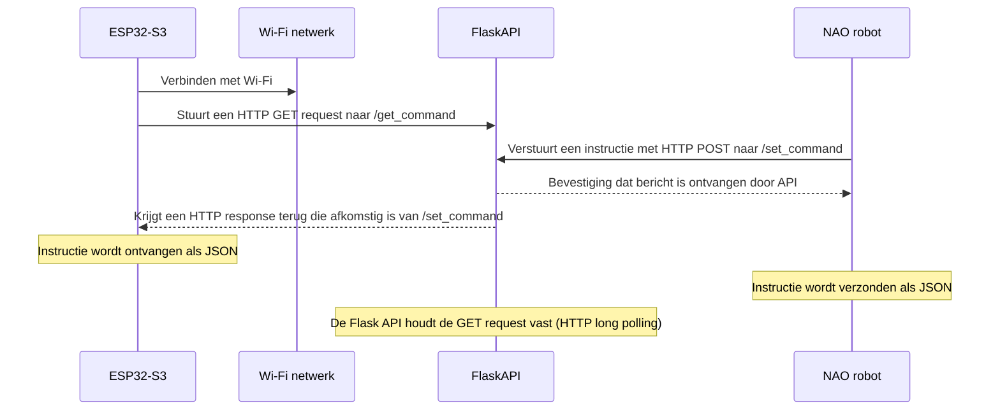
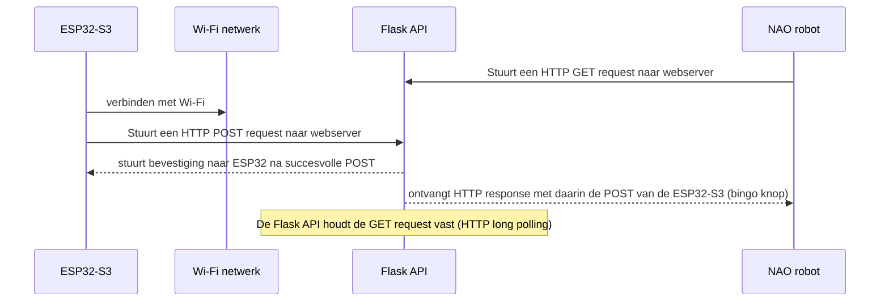

# NAO Bingo project | netwerk documentatie

In dit document wordt uitgelegd hoe de communicatie tussen de NAO robot, de ESP32 microcontrollers en de database zal verlopen. In de eerste sprint van het project was er nog veel discussie over hoe we de communicatie tussen de NAO robot en de randapparatuur zouden gaan aanpakken. Een idee was om het via een lokale raspberry pi te doen, deze kwam dan op de rug van de NAO robot en alle ESP32 microcontrollers waren dan via Wi-Fi of bedraad verbonden met de deze raspberry pi. 

Omdat we uiteindelijk met een database wilden gaan werken in het project, en op basis van feedback die we hadden gekregen van een docent hadden we toch besloten om het via een server op school te doen. Op dit moment maken we gebruik van een raspberry pi 3 die op dit moment in een serverruimte draait van HBO-ICT op de Hogeschool van Amsterdam. 

>Op dit moment hebben we de volgende apparaten die betrokken zijn bij de gegevens overdracht:

- ESP32-S3 Microcontroller
- Wi-Fi hotspot met internet toegang
- Raspberry Pi 3 (met daarop een webserver)
- NAO robot met internet toegang (d.m.v ethernet kabel)

## Prijsautomaat communicatie met webserver (huidige situatie)


---
Op deze rasberry pi 3 draait een apache webserver met daarop een flask API. Het is straks de bedoeling dat de NAO robot en de microcontrollers via de API's van de webserver met elkaar kunnen communiceren. Door onze netwerk infrastructuur op deze manier op te zetten is het uiteindelijk ook zeer envoudig om de database functionaliteit in ons project te implementeren aangezien het voor de microcontrollers/NAO robot via de API's redelijk eenvoudig is om met de database te kunnen praten.

>Ik was van plan om de communicatie tussen de bingo knop en de NAO robot op dezelfde manier op te zetten. Ik ben echter nog aan het kijken of er ook alternatieve methodes zijn hiervoor.

## Communicatie tussen bingo knop en de NAO robot (CONCEPT)


---

## Update 5-6-2024

```mermaid
    flowchart TB
        c1 >a2
        subgraph one
        a1 >a2
        end
        subgraph two
        b1 >b2
        end
        subgraph three
        c1 >c2
        end
```
