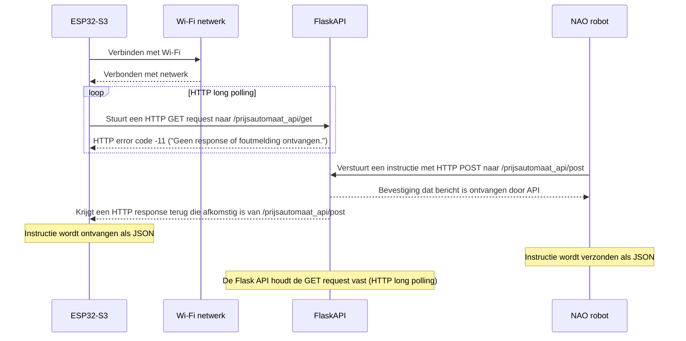
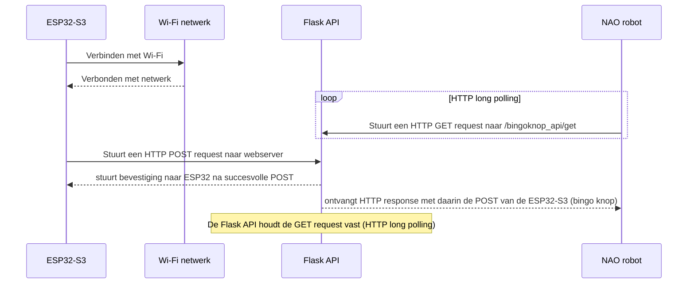

# NAO Bingo project | netwerk documentatie

In dit document wordt uitgelegd hoe de communicatie tussen de NAO robot, de ESP32 microcontrollers en de database zal verlopen. In de eerste sprint van het project was er nog veel discussie over hoe we de communicatie tussen de NAO robot en de randapparatuur zouden gaan aanpakken. Een idee was om het via een lokale raspberry pi te doen, deze kwam dan op de rug van de NAO robot en alle ESP32 microcontrollers waren dan via Wi-Fi of bedraad verbonden met de deze raspberry pi. 

Omdat we uiteindelijk met een database wilden gaan werken in het project, en op basis van feedback die we hadden gekregen van een docent hadden we toch besloten om het via een server op school te doen. Op dit moment maken we gebruik van een raspberry pi 3 die op dit moment in een serverruimte draait van HBO-ICT op de Hogeschool van Amsterdam. 

>Op dit moment hebben we de volgende apparaten die betrokken zijn bij de gegevens overdracht:

- ESP32-S3 Microcontroller
- Wi-Fi hotspot met internet toegang
- Raspberry Pi 3 (met daarop een webserver)
- NAO robot met internet toegang (d.m.v ethernet kabel)

## Prijsautomaat communicatie met webserver (GET)

---
## Communicatie tussen bingo knop en de NAO robot (POST)

Op onze rasberry pi 3 draait een apache webserver met daarop een flask API. Het is straks de bedoeling dat de NAO robot en de microcontrollers via de API's van de webserver met elkaar kunnen communiceren. Door onze netwerk infrastructuur op deze manier op te zetten is het uiteindelijk ook zeer envoudig om de database functionaliteit in ons project te implementeren aangezien het voor de microcontrollers/NAO robot via de API's redelijk eenvoudig is om met de database te kunnen praten.

## HTTP long polling
Voor het opzetten van de netwerk infrastructuur hadden we besloten om gebruik te maken van het HTTP protocol. We konden er ook voor kiezen om de verbinding tussen de microcontrollers en de webserver op te zetten met MQTT of websockets. Het probleem echter met MQTT en websockets is dat deze niet direct het schoolnetwerk kunnen penetreren in verband met firewalls. HTTP was het enige protocool waar ik success mee had tijdens het testen. Om ervoor te zorgen dat de actuatoren bijna in real-time kunnen worden aangestuurd door de NAO robot/het bingospel, maken we gebruik van **HTTP long polling**. In plaats van dat de server/api meteen een response terug stuurt naar de client wordt de verbinding open gehouden. Na 30 seconden wordt de verbinding afgesloten en opnieuw opgezet. De bedoeling hiervan is dat als de api tijdens die 30 seconden een bericht/instructie ontvangt van het spel, dat de api dit bericht dan meteen kan door sturen naar de client zonder eerst weer een verbinding te hoeven opzetten. Hierdoor kunnen clients berichten over het internet in bijna real-time ontvangen.

Het is een vrij oude en non-conventionele manier van gegevensoverdracht en ik zou eigenlijk ook het liefst websockets of MQTT willen toepassen. Dit was echter de enige methode die werkte, en het werkt prima voor wat we willen bereiken.
