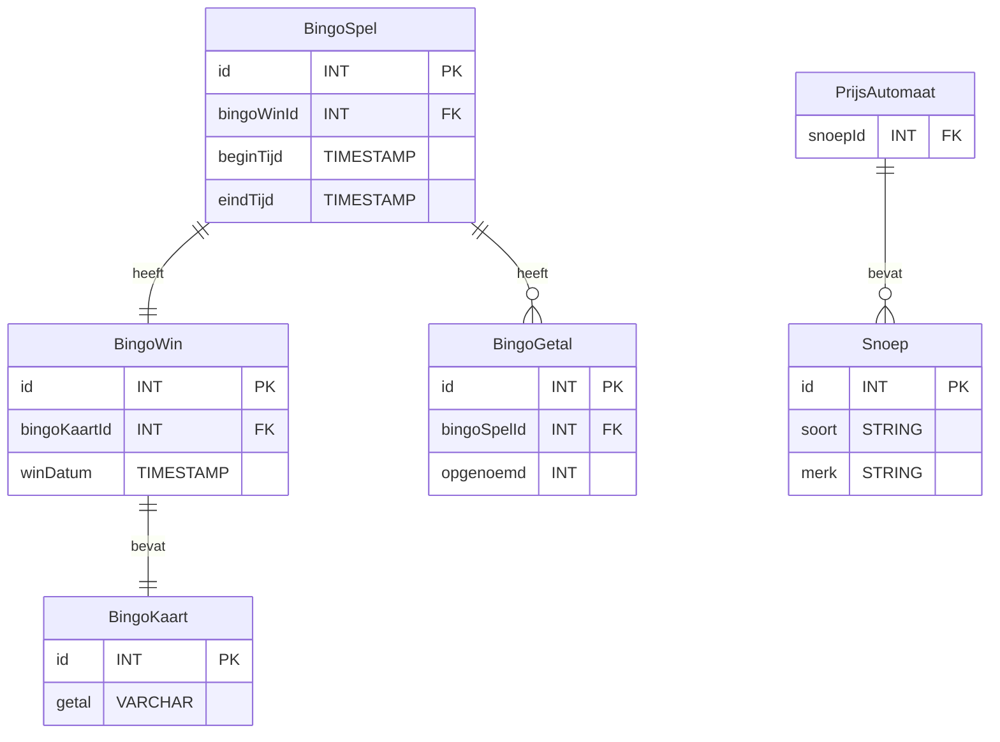

# ERD / Huidige database ontwerp 

>**Notitie 1:** Er zijn meerdere bingokaarten aangemaakt in tabel BingoKaart. BingoWin bevat 1 een bingokaart. Een BingoSpel bevat 1 BingoWin aangezien er per bingospel maar 1 winnaar kan zijn.

### Database ontwerp uitgewerkt in SQL | sprint 3

Dit is uiteindelijk het database ontwerp dat we hebben geïmplementeerd. Zodra het spel begint wordt er eerst een nieuwe BingSpelId aangemaakt waar later de omgeroepen getallen aan worden gekoppelt. 

In het BingoGetal tabel worden de omgeroepen nummers opgeslagen die gekoppelt zijn aan een BingSpelId. Hiermee kan men waarnemen wel getallen in welke volgorde waren omgeroepen per bingo ronde.

Tenslotte wordt er een winId gekoppelt aan de bijbehorende spelId.

We hebben als concept ook nog een prijsautomaat tabel met een snoep tabel toegevoegd als concept van wat we nog konden implementeren in de database.