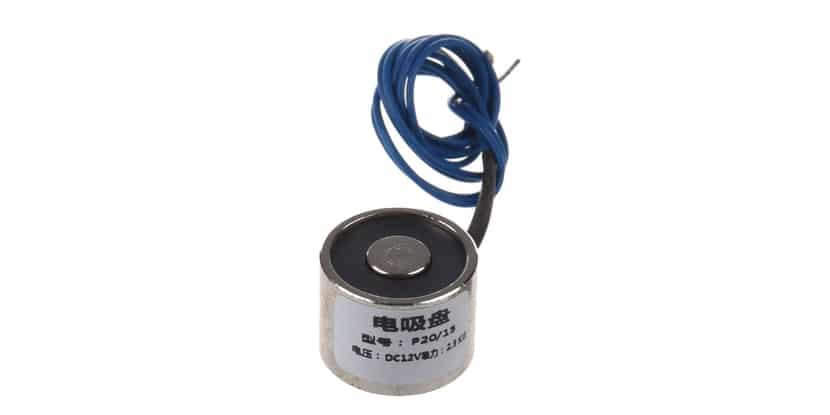

## Elektromagneet

Wij gaan elektromagneten gebruiken om de ballen van bingo te kunnen pakken.

#### **Aansluiten:**

**Voeding:** De elektromagneet heeft waarschijnlijk een aparte 12V DC-voeding nodig, maar dat is nog niet zeker.

**Verbinding:** Sluit de positieve (+) gpio pin en negatieve (-) ground pin, op een geschikte voedingsbron (bijvoorbeeld een 12V DC-voeding). 

**GPIO-pin:** De GPIO-pin op de ESP32, je mag kiezen welke je wilt gebruiken om de elektromagneet aan te sturen, het maakt niet uit welke. 

bron:
[Elektromagneet documentatie](https://cdn.velleman.eu/downloads/29/vma431_a4v01.pdf)