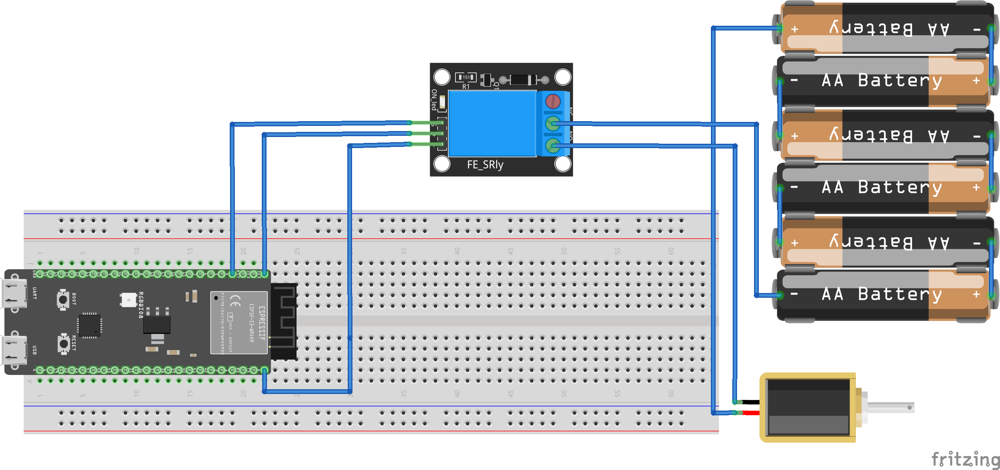

## Elektromagneet

Dit document beschrijft het ontwerp van een embedded systeem dat gebruik maakt van een ESP32-S3 microcontroller, een relais, een 12V batterij en een elektromagneet. Het doel van dit systeem is om een elektromagnetisch schakelmechanisme te realiseren dat gecontroleerd wordt door de ESP32-S3. Deze documentatie zal de specificaties van de gekozen componenten uitleggen en de redenen achter de gemaakte keuzes verduidelijken.

## Overzicht van het Systeem

Het systeem bestaat uit de volgende componenten:
- ESP32-S3 Microcontroller
- Relais
- 12V Batterij
- Elektromagneet

De ESP32-S3 stuurt het relais aan, dat op zijn beurt de stroomtoevoer naar de elektromagneet controleert. De 12V batterij voorziet zowel het relais als de elektromagneet van de nodige stroom.

## Specificaties van de Componenten
  
### ESP32-S3 Microcontroller:
  
- Voedingsspanning: 3.3V.
- I/O Pin: GPIO-pin 4.
  
Keuze: De ESP32-S3 is gekozen vanwege zijn krachtige dual-core processor, ruime geheugen, en geïntegreerde Wi-Fi en Bluetooth connectiviteit. Dit maakt het een veelzijdige keuze voor embedded systemen die netwerkfunctionaliteiten vereisen.

### Relais:

- Type: 5V DC relais.
- Schakelspanning: Tot 250V AC of 30V DC.
- Schakelstroom: Tot 10A.
   
Keuze: Het relais is essentieel om de hoge stroom die door de elektromagneet gaat, veilig te kunnen schakelen met de lagere stuurspanning van de ESP32-S3. Een 5V relais is gekozen omdat het makkelijk aangestuurd kan worden door de 3.3V logica van de ESP32-S3 met een simpele transistor circuit.

### 12V Batterij
  
- Type: AA
- Capaciteit: 7Ah.
- Spanning: 12V.

Keuze: 6 AA batterijen van ieder 1.5V in serie voorziet het systeem van voldoende stroom voor langere tijd en kan herladen worden, wat handig is voor portable toepassingen. De capaciteit van 7Ah biedt genoeg energie voor langdurig gebruik zonder frequente herlaadbeurten.

### Elektromagneet
  
- Bedrijfsspanning: 12V DC.
- Stroomverbruik: 500mA bij 12V.
- Houdkracht: 5kg.

Keuze: De elektromagneet met een bedrijfsspanning van 12V is gekozen om compatibel te zijn met de batterij. De stroomverbruik van 500mA is binnen de capaciteit van de gekozen batterij en het relais. De houdkracht van 5kg is voldoende voor de meeste standaard toepassingen waarbij een elektromagnetische schakelmechanisme vereist is.

## Reden voor Componentkeuzes
- ESP32-S3: Voorzien van Wi-Fi en Bluetooth, ideaal voor IoT toepassingen en biedt voldoende rekenkracht en geheugen voor complexe taken.
- Relais: Noodzakelijk om de hoge stroom voor de elektromagneet te kunnen schakelen zonder de ESP32-S3 te overbelasten.
- 12V Batterij: Zorgt voor voldoende en langdurige stroomvoorziening, essentieel voor portable toepassingen.
- Elektromagneet: Geschikt voor verschillende toepassingen met een betrouwbare houdkracht en compatibele werkspanning.

  
Dit embedded systeem biedt een robuuste en efficiënte oplossing voor het schakelen van een elektromagneet, gecontroleerd door een ESP32-S3. De gekozen componenten zijn zorgvuldig geselecteerd om te voldoen aan de specificaties en vereisten van het project, met een focus op betrouwbaarheid, compatibiliteit en gebruiksgemak.

bron:
[Elektromagneet documentatie](https://cdn.velleman.eu/downloads/29/vma431_a4v01.pdf)