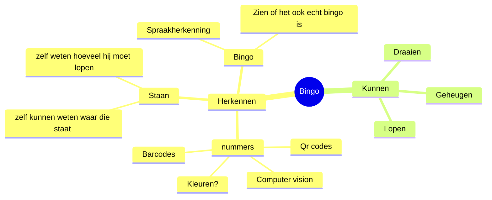

## Ons idee
### Mindmap

### Waarom
    Onze doelgroep zijn ouderen in de zorg, er is een hoog   
    procent van de ouderen die bingo kennen dus wouden we ai 
    implementeren in de zorg om de ouderen te entertainen.

### sprint 1 feedback

Vendingmachine:

De vendingmachine gebruikt een esp (en misschien een raspberry) om de elektromagneet en dus vending machine aan te sturen. De database wordt aangestuurt door mogelijk de esp, maar als dat niet kan dan de raspberry. De NAO 

Wat vond de opdrachtgever van wat jullie gepresenteerd hebben tijdens de Sprint Review? Wat waren de positieve punten (tops) en wat waren de verbeterpunten (tips)?

Het idee en de gedachten achter het idee vond hij leuk, hij had nog veel vragen over de uitvoering qua pi, de embedded en waarom we het gebruiken. Critiek op de database als in dat het onnodig was hoe we het nu wouden gebruiken en dat we daar wat meer in moesten gaan verdiepen. En we moesten kijken naar de implementatie van de embedded en dat we esp 32 gebruiken voor het controllen van de sensoren en actuatoren.

Welke User Stories hebben jullie af kunnen ronden tijdens deze sprint? Geef een overzicht.

We hebben voor deze sprint (sprint 1) 2 userstories afgerond. Het gaat om de volgende userstories:

- Als gebruiker wil ik dat de robot beweegt zodat ik meer interactie heb ermee

Voor sprint 2 willen wij werken aan de volgende userstories:

- Als gebruiker wil ik dat de robot de bingo-kaart kan controleren

- Als gebruiker wil ik dat de robot de spel bingo kan leiden zodat ik het kan spelen zonder enig probleem

- 

Userstories Sprint 2

- 

