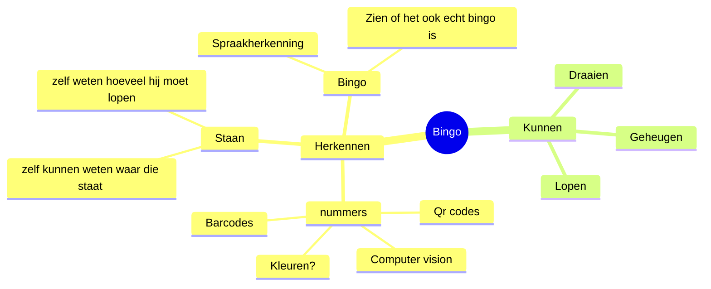

## Ons idee
### Mindmap

### Waarom
    Onze doelgroep zijn ouderen in de zorg, er is een hoog   
    procent van de ouderen die bingo kennen dus wouden we ai 
    implementeren in de zorg om de ouderen te entertainen.

