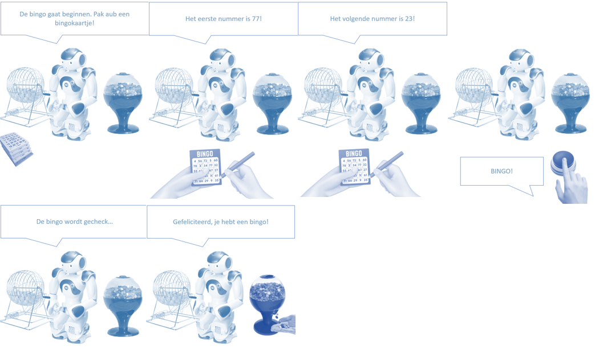
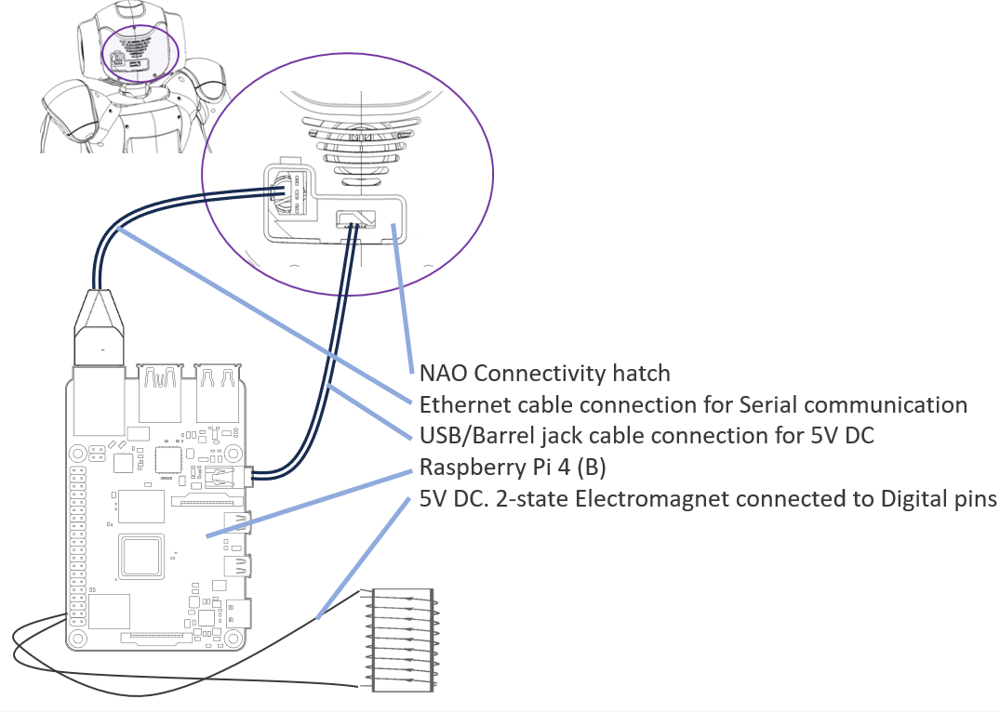
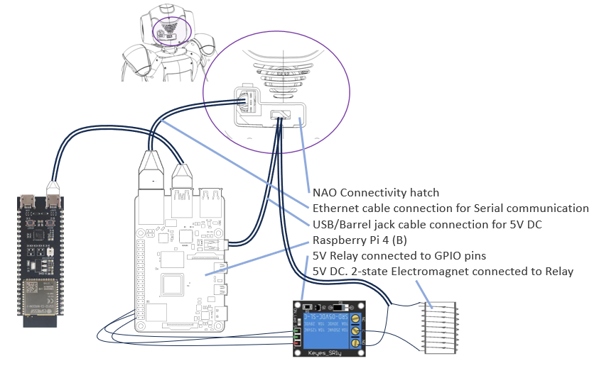
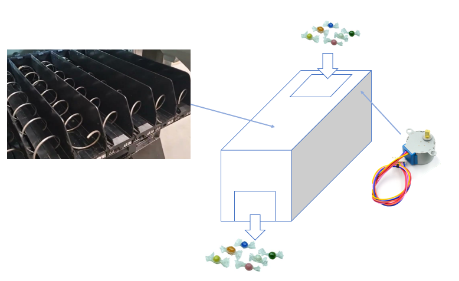
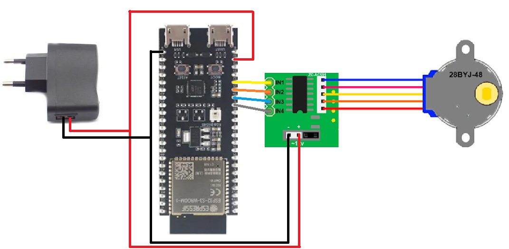
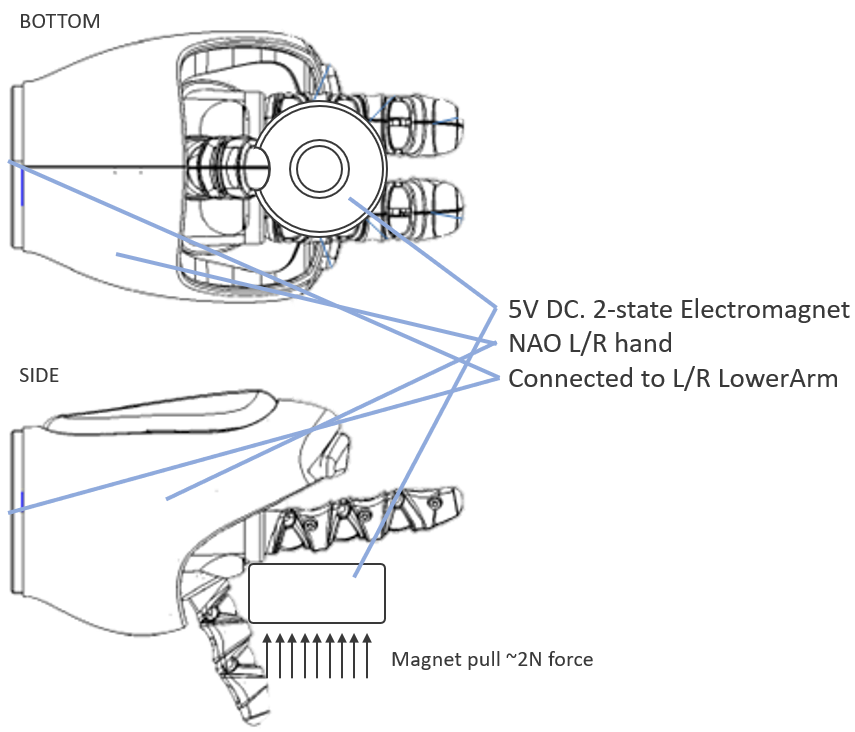
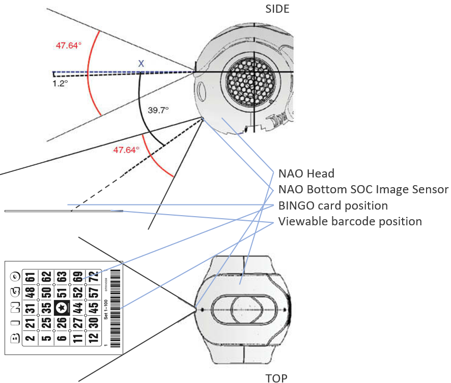

# Productomschrijving

## Doel

>*"Wanneer je denkt aan robots zal je vaker denken aan een high-tech omgeving, maar robots kunnen ook een educatief, zorg of entertainment toepassing hebben. In dit project ga je aan de slag met het ontwikkelen van een robot-toepassing voor het Amstelhuis of de Buurtcampus. De robot-toepassing moet een educatief / entertainment karakter hebben en laagdrempelig zijn voor mensen die geen technische achtergrond hebben."*
[**-Zie opdrachtomschrijving**](../opdracht/assignment.md)

Eisen voor klant:

- Het product moet een educatief / entertainment karakter hebben.
- Het product moet laagdrempelig zijn voor ouderen.
- Het product moet een fysieke component hebben.

Eisen voor docent:

- Het product moet een database benutten.
- Het product moet een embedded layer bevatten.

## Concept

Wij hebben het idee om het spel BINGO te maken met behulp van een NAO robot. De opstelling zal bestaan uit een NAO robot die voor een tafeltje staat. Op de tafel staat de Bingo ballen-kooi waar de NAO robot aan kan draaien. De NAO pakt de Bingo-ballen op en roept het nummer. Als iemand Bingo roept zal NAO stoppen en kijken naar een plek op de tafel waar de speler zijn of haar Bingokaart kan neerleggen. Dan scant NAO de barcode/QR-code op de Bingokaart en geeft hij aan of de speler heeft gewonnen of niet.

## StoryBoard

Om het gebruik van ons product makkelijk uit te leggen hebben we een storyboard gemaakt van de verschillende taken die worden uitgevoerd.

## Realisatie

### Connectie met Raspberry Pi

Zodat de NAO consistent de Bingo-ballen kan oppakken maken we gebruik van een elektromagneet die na activatie de metalen ballen kan oppakken. Om deze elektromagneet aan te sturen maken we gebruik van een Raspberry Pi die op de rug van de NAO robot is gepositioneerd. Deze Raspberry Pi is verbonden met de NAO robot via de **ethernet aansluiting** op de achterkant van de NAO. De Raspberry Pi zal 5V DC krijgen door te verbinden met de **USB aansluiting** op de achterkant van de NAO

Tijdens de feedback van ons sprintreview is ons duidelijk geworden dat we een extra embedded hardware moeten toevoegen. Wij gaan dus een een ESP 23 S3 toevoegen die kan praten met de Raspberry Pi.

### Prijzen uitgeven

Als toevoeging bij het spel willen wij prijzen uitgeven wanneer iemand wint. Dit zal gebeuren met behulp van een snoepautomaat die verbonden is met de Raspberry Pi.

We zullen het standaart ontwerp hanteren voor een *spiraalautomaat*, waarbij met behulp van een stepper motor snoep wordt geleverd aan de winnaar. Hieronder een Pinout diagram voor dit embedded systeem;

De aangegeven componenten zijn als volgt;

- ESP32 S3
- Usb Charger 5V 2A - Power Adapter 100V-240V
- Stepper motor 28byj-48-5V
- ULN2003 Stepper Motor Driver Board

### Bingo ballen oppakken

De NAO fingergrip is niet exact genoeg om Bingo-ballen op te pakken. Om consistent de Bingo-ballen op te pakken maken we gebruik van een elektromagneet. **LET OP: De Bingo-ballen moeten Ferromagnetisch zijn.** Dit elektromagneet word gepositioneerd in de linker- of rechterhand van de NAO met behulp van een 3d print.

### Bingo kaart scannen

Om te weten of een speler een Bingo heeft moet de NAO de Bingo-kaart kunnen zien.

#### Afwegingen:

- Direct scannen van Bingo nummers
- Scannen barcode onderaan Bingo-kaart
- Scannen QR-code achterkant Bingo-kaart
- Honor System

De beste optie leek ons het scannen van een barcode die onderaan de Bingo-kaart is geplaatst. Zo hoeft de NAO geen algoritme te gebruiken om de Bingo-kaart te ontcijferen. Ook is het gebruik van het *Honor system* niet mogelijk omdat bij Bingo de spelers fouten kunnen maken. De Bingo-kaart moet wel op een vooraf geselecteerde plek worden laten zien. **De Bingo-kaart word dus op de tafel neer gelegt op een specifieke plek.**

### Bill of materials

De opstelling zal de volgende materialen bevatten. hier onze voorlopige BOM;

>**LET OP:** Deze Bill of materials bevat nog niet de exacte specificaties voor verschillende materialen.

- NAO robot
- Bingo ballen-kooi
- metalen (Bingo)ballen
- Raspberry Pi 4 (B)
- Bingo kaarten (met barcode/QR-code)
- Electromagneet
- Ethernet kabel
- USB naar Raspberry Pi barrel jack 5V DC Stroomkabel

### Database

De Raspberry Pi zal een database bevatten zodat de NAO geen internet verbinding nodig zal hebben om zijn taak uit te voeren.

**Wij hebben 2 opties bedacht voor mogelijke databases;**

1. De Raspberry Pi zal een database bevatten die de Bingo-kaarten en nummers zal opslaan.
2. De Raspberry Pi zal een database bevatten die de scores zal opslaan.

Zie [link](../database/database_erd_concept.md) voor ERD concept van optie 2.

## Eventuele toevoegingen

Om problemen voor te zijn hebben we eventuele veranderingen aan ons product bedacht als we te veel of te weinig tijd hebben. Zo zal altijd een **minimal viable product** worden afgeleverd.

Hier wat eventuele toevoegingen aan het product;

- scherm naast NAO waar momenteel Bingo-nummer wordt weergeven.
- 8-Segment display naast NAO waar momenteel Bingo-nummer wordt weergeven.
- Aan/Uit knop voor NAO robot en imbedded hardware.
- Extra luidsprekers voor NAO

## Eventuele inperkingen

- substitutie voor Bingo roepen is een indrukken van een knop mogelijk.