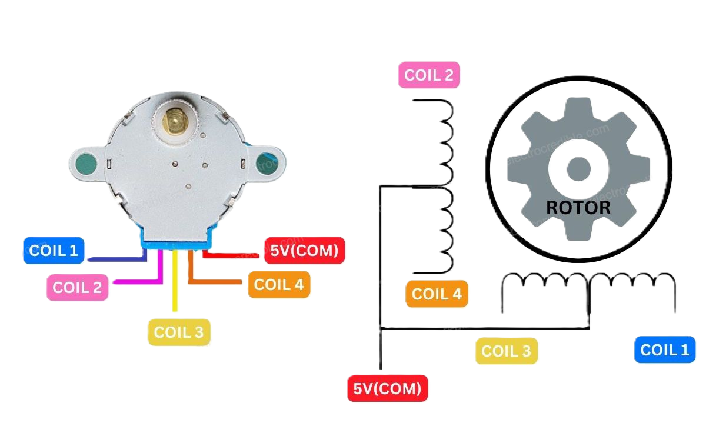

# Prijsautomaat

**Inleiding**

In dit project gaan we een bingo spel maken voor ouderen met behulp van een Aldebaran NAO6 (H25) robot en verschillende geautomatiseerde spel onderdelen zoals bijvoorbeeld een bingobal die automatisch kan spinnen of een knop waarmee aan de robot kan worden aangegeven zodra er een bingo wordt gescoord . Tijdens het spelen van de bingo willen we ouderen de mogelijkheid bieden om op meerdere manieren te kunnnen interacteren met het bingospel. Het is de bedoeling dat we hiermee de ouderen kunnen entertainen door middel van de robot en de bijbehorende randapparatuur. We willen met dit project aan onze opdrachtgever en onze eindgebruiker laten zien welke mogelijkheden er zijn met de technologie waar wij op dit moment mee werken.

In dit project willen we een prijsautomaat gaan maken die een prijs (snoepje) kan uitdelen zodra een van de deelnemers een bingo scoort. Suiker is niet goed voor ouderen, maar het gezondheidsaspect komt helaas niet aanbod binnen dit project. Het is de bedoeling dat de vending machine kleine snoepjes kan uitdelen zoals een mini snickers of een caramelsnoepje. Het formaat van de prijsautomaat hoeft dus niet heel groot en complex te zijn. We willen de functies van de vending machine volledig automatiseren zodat het spel eenvoudig te spelen is.

---

## Overzicht | Aansluitschema steppermotor 28BYJ-48 + ULN2003 Driver met ESP32-S3 microcontroller


Op dit schema kun je zien welke onderdelen met elkaar zijn aangesloten. De breadboard van de prijsautomaat bevat 4 onderdelen: ESP32-S3 microcontroller, ULN2003 motor drive, 28BYJ-48 steppermotor, 9V alkaline batterij. 

---

# Actuator voor prijsautomaat

Het is dus de bedoeling dat de prijsautomaat uitzichzelf een snoepje kan afgeven zonder externe fysieke input zodra iemand een bingo scoort. De prijsautomaat zal worden aangestuurd via een server op school. We hebben op dit moment een simpele behuizing gemaakt voor de prijsautomaat waar de snoepjes in komen. Om de snoepjes geordend in de prijsautomaat te houden en ze er een voor een eruit te laten duwen door de draaimotor maken we gebruik van een metalen spiraal. Deze spiraal maken we aan het uiteinde vast aan de draaistaaf van de steppermotor. Tussen de gleuven van de spiraal kunnen de snoepjes worden geplaatst.

Een aantal punten/eigenschappen die we belangrijk vonden voor het kiezen van een actuator:

- Prijs/verkrijgbaarheid
- Energieconsumptie
- Krachtlevering
- Formaat
- Eventueel gewicht (dit is alleen een factor bij grote afwijkingen en de type behuizing)

## Steppermotor 28BYJ-48 (met ULN2003 Driver)


Voor het aandraaien van de spiraal hadden we gekozen voor de **28BYJ-48** steppermotor. Deze wordt aangestuurd door middel van een ULN2003 motor driver. We hadden gekozen voor deze stepper motor omdat deze motor sterk genoeg was om de spiraal goed te kunnen laten draaien met snoepjes erin. 

De steppermotor werkt op 5V DC en de steppermotor wordt op dit moment aangedreven door een 9V alkaline batterij. De steppermotor is qua formaat groter en zwaarder dan de SG90 Servo 9G. We wilden eerst gebruik maken van de SG90 servo motor maar deze vonden we uiteindelijk niet sterk genoeg. Ondanks dat de **28BYJ-48** iets groter is dan de servo motor die we eerder wilden gebruiken, past deze stepper motor prima in de prototype behuizing van onze prijsautomaat. Een nadeel van deze stepper motor is dat hij aanzienlijk veel stroom verbruikt zodra hij aan gaat, zelfs als de motor niet draait (doordat het zijn oriëntatie positie blijft behouden).

---

## ULN2003 Driver


De **ULN2003** motor driver wordt gebruikt om de stepper motor via een digitale bron aan te sturen en van stroom te voorzien. De steppermotor is via deze motor driver verbonden met een ESP32-S3 microcontroller met 4 pinnen (IN1, IN2 IN3 IN4).
**28BYJ-48 Pinout** | De stepper motor is met 5 draadjes verbonden met de ULN2003 Driver, 4 draadjes voor de coils (elke 1 coil) en 1 draadje voor stroom (5V). Elke coil kan via de motor driver met de IN (1-4) pinnen door de ESP32 microcontroller digitaal worden aangestuurd. <br>



---


## Specificaties 28BYJ-48 en voorbeeld code

*Specificaties van de 28BYJ-48 steppermotor*

- **Lengte:**	28 mm
- **Breedte:**	28 mm
- **Hoogte:**	18 mm
- **Gewicht:** 34 g

- **Voltage:** 5V(DC)
- **Energie consumptie:** 240 mA
- **Kabel lengte:** 24cm
- **kracht:** >34.3 mN.m
- **Fases:** 4
- **Ratio:** 1/64
- **Step hoek:** 5.625 x 1/64

### Code die gebruikt kan worden om de steppermotor te testen

```cpp
//Includes the Arduino Stepper Library
#include <Stepper.h>

// Defines the number of steps per rotation
const int stepsPerRevolution = 2048;

// Creates an instance of stepper class
// Pins entered in sequence IN1-IN3-IN2-IN4 for proper step sequence
Stepper candyMotor = Stepper(stepsPerRevolution, 12, 10, 11, 9);

void setup() {
    Serial.begin(115200);
}

void loop() {
    Serial.println("Looping...");
    // Rotate CW slowly at 5 RPM
    candyMotor.setSpeed(10);
    candyMotor.step(-stepsPerRevolution);
    delay(1000);
    
    // Rotate CCW quickly at 10 RPM
    candyMotor.setSpeed(10);
    candyMotor.step(-stepsPerRevolution);
    delay(1000);
}
```


## Informatie over concept behuizing prijsautomaat

```
We hebben verschillende ideeën en manieren om de vendingmachine uit te werken. Een concept die we hebben is dat we een kartonnen doos maken met een gat in waar je het snoep in valt zodra er iemand een bingo scoort. De kartonnen doos die we nu hebben als concept is groot voor het idee dat we in gedachte hadden. Voordelen voor het kartonnen doos concept is dat je simpele- en goedkope materialen kunt gebruiken voor het ontwikkelen van de vendingmachine. Een nadeel is dat dit ontwerp minder stabiel kan zijn en moeilijker is om in elkaar te zetten. Het kan bijvoorbeeld ingewikkelder zijn om een servo- of stepper motor te installeren. 

We kunnen ook een behuizing voor een vending machine printen. Het concept hiervan zouden we kunnen uitwerken in een 3D ontwerp programma zoals Fusion 360 of Solidworks. 
```