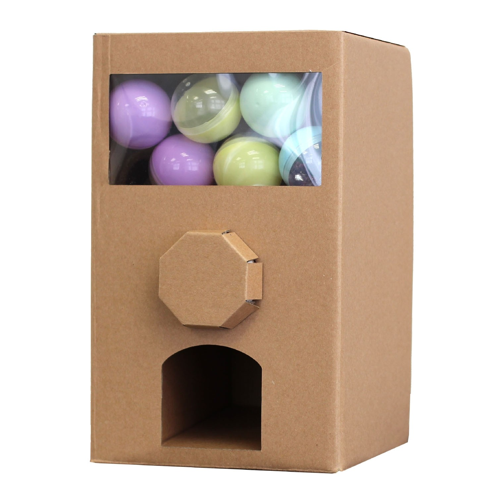
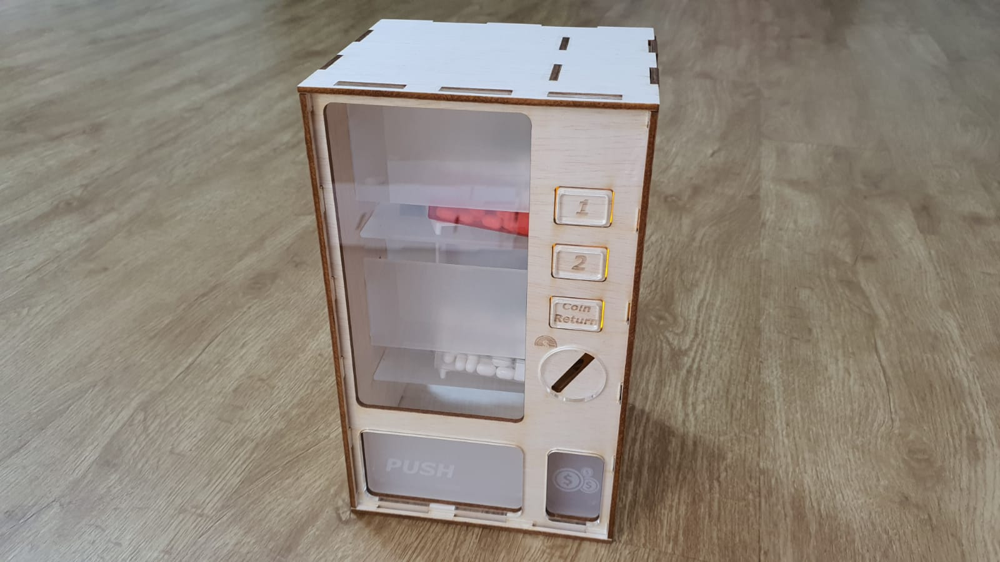

## Vending machine (prototype 1)

**Benodigheden**
- Karton (behuizing)
- Servo?, Motor? (sensoren)
- Snoepjes (gifts)

## Behuizing 

De eerste prototype willen we dat het van karton wordt gemaakt als een voorbeeld van het idee die we hebben. Vervolgens willen we het via hout met laserprint uitprinten zodat we het in elkaar kunnen bouwen. 

Op zo een soort manier qua hout maar dan de ontwerp als de eerste prototype (de karton prototype)

## Sensoren

Wij hebben over verschillende opties nagedacht zoals:
- Servo
- Stappenmotor
- TT- Motor voor aandrijving wielen dubbele as (actuator)

## TT- Motor voor aandrijving wielen dubbele as (OT4880)
**Eigenschappen:**
- Bedrijfsspanning: 3V tot 6V
- RPM: 200 bij 4.5V
- 170mA bij 4.5V
- max koppel: 800gf cm min
- as aan beide zijden

**Afmetingen**
Lengte: 6,4cm
Breedte: 1,8cm
Hoogte: 2,2cm

