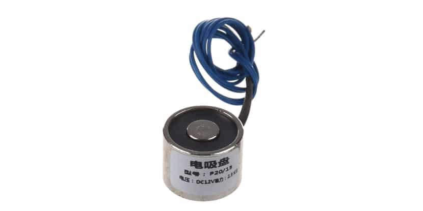

## Elektromagneet

Wij gaan elektromagneten gebruiken om de ballen van bingo te kunnen pakken.

Aansluiten:

Voeding: De elektromagneet heeft waarschijnlijk een aparte 12V DC-voeding nodig, maar dat is nog niet zeker.

Verbinding: Sluit de positieve (+) en negatieve (-) draden van de elektromagneet aan op een geschikte voedingsbron (bijvoorbeeld een 12V DC-voeding). Zorg ervoor dat de elektromagneet correct is georiënteerd en dat de polariteit overeenkomt met de voedingsbron.
GPIO-pin: Kies een GPIO-pin op de ESP32 die je wilt gebruiken om de elektromagneet aan te sturen. Zorg ervoor dat deze pin geschikt is voor het leveren van voldoende stroom voor de elektromagneet.
