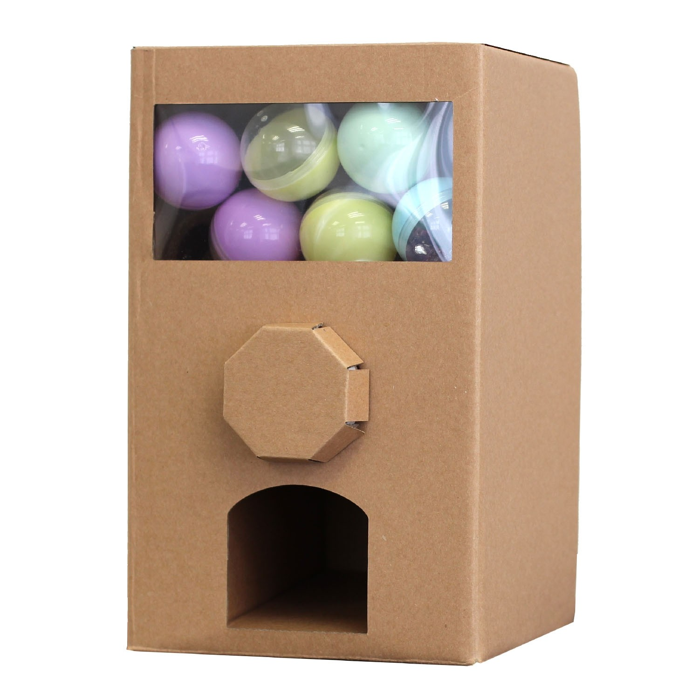
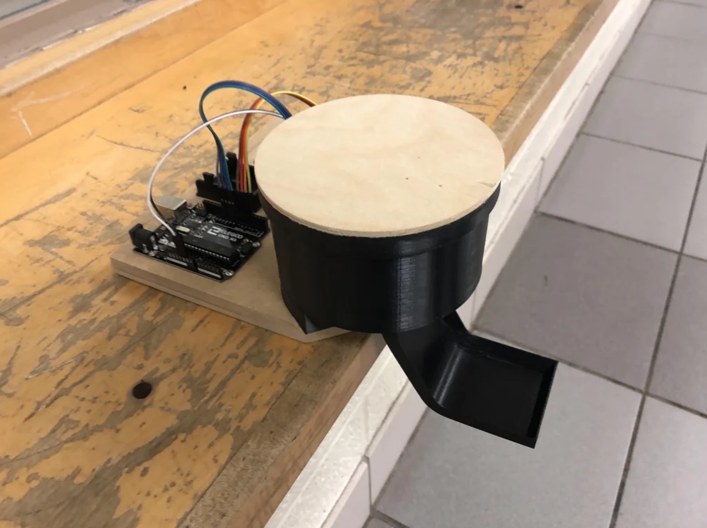

# Aandrijving klep vendingmachine

**Inleiding probleembeschrijving**

In dit project gaan we een bingo spel maken voor ouderen met behulp van een Aldebaran NAO6 (H25) robot en verschillende actuatoren die bijvoorbeeld de bingobal laten draaien of een snoepjesmachine die een snoepje kan afgeven zodra iemand een bingo heeft gescoord. Tijdens het spelen van de bingo willen we ouderen de mogelijkheid bieden om op meerdere manieren te kunnnen interacteren met het bingospel.

---

In dit project willen we een vendingmachine gaan maken die een prijs (snoepje) kan uitdelen zodra een van de deelnemers een bingo scoort. Suiker is niet goed voor ouderen, maar het gezondheidsaspect komt helaas niet aanbod binnen dit project. Het is de bedoeling dat de vending machine kleine snoepjes kan uitdelen zoals een mini snickers of een caramelsnoepje. Het formaat van de vendingmachine hoeft dus niet heel groot en complex te zijn. We willen de functies van de vending machine volledig automatiseren zodat het spel eenvoudig en vloeiend te spelen is.

## Informatie over concept behuizing vending machine

```
We hebben verschillende ideeën en manieren om de vendingmachine uit te werken. Een concept die we hebben is dat we een kartonnen doos maken met een gat in waar je het snoep in valt zodra er iemand een bingo scoort. De kartonnen doos die we nu hebben als concept is groot voor het idee dat we in gedachte hadden. Voordelen voor het kartonnen doos concept is dat je simpele- en goedkope materialen kunt gebruiken voor het ontwikkelen van de vendingmachine. Een nadeel is dat dit ontwerp minder stabiel kan zijn en moeilijker is om in elkaar te zetten. Het kan bijvoorbeeld ingewikkelder zijn om een servo- of stepper motor te installeren. 

We kunnen ook een behuizing voor een vending machine printen. Het concept hiervan zouden we kunnen uitwerken in een 3D ontwerp programma zoals Fusion 360 of Solidworks. 
```
## Voorbeelden van concepten





---

# Actuatoren voor vendingmachine

Het is dus de bedoeling dat de vendingmachine uitzichzelf een snoepje kan droppen zonder externe fysieke input zodra iemand een bingo scoort.

Bij de vending machine willen we dus een actuator gebruiken die dit proces kan automatiseren. 

Opties voor soorten actuatoren die we kunnen gebruiken:

- draaimotoren
- draaiklep

Bij het kiezen van actuatoren is het belangrijk dat men kijkt naar de volgende eigenschappen van een type actuator:

- Prijs/verkrijgbaarheid
- Energieconsumptie
- Krachtlevering
- Formaat
- Eventueel gewicht (dit is alleen een factor bij grote afwijkingen en de type behuizing)

Wij denken voor nu dat we gebruik gaan maken van een draaimotor. 

We hebben gekeken naar een paar soorten draaimotoren.

- Servomotor
- Steppermotor

## Steppermotor 28BYJ-48 (met ULN2003 Driver)

https://lastminuteengineers.com/28byj48-stepper-motor-arduino-tutorial/


