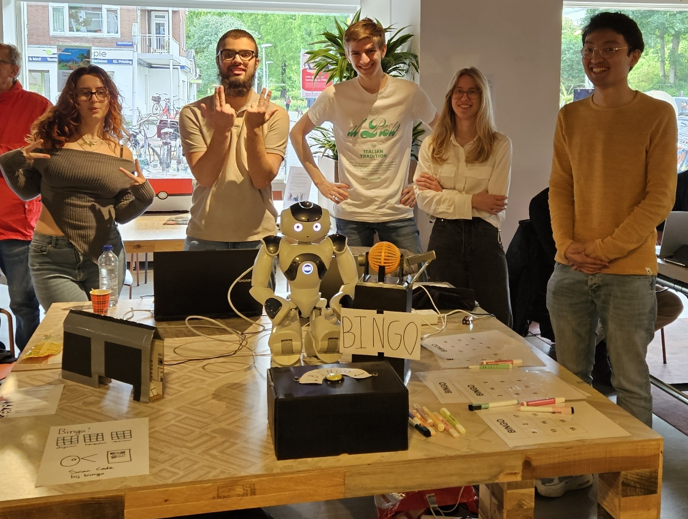
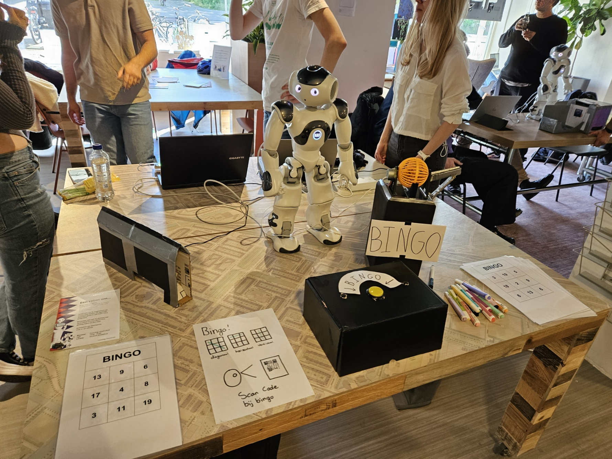

# Sprint Report - Sprint 3

**Opdracht**: NAO Robot  
**Sprint**: Sprint 3  
**Team**: 3  
**Auteurs**:  Brian, Tyler, Amin, Tess, Ana  
**Datum**:  11-6-2024  
**Versie**: v1

---

***Presentatie van ons project bij Buurtcampus Oost***

## Inleiding

**Schrijf hier een inleiding voor het sprint report. Wat is jullie opgevallen tijdens deze sprint?**

We hebben in onze laatste sprint gewerkt aan het samenvoegen van alle losse embedded hardware, dit is ons geluk met behulp van de gemaakte flask api. Onze NAO is voorzien van software die de game host en samen met de vending machine, het bingorat en de Bingo knop een compleet spel vormt.

## Feedback opdrachtgever

**Wat vond de opdrachtgever van wat jullie gepresenteerd hebben tijdens de Sprint Review? Wat waren de positieve punten (tops) en wat waren de verbeterpunten (tips)?**

- Het project ziet er goed uit. Vooral omdat het een werkend product is waar de mensen al van kunnen genieten

## Feedback doelgroep

- Ouderen zijn niet zo snel, ze vinden het soms moeilijk om onderscheid te maken tussen bepaalde getallen. 
    - De herhaal functie kan dus wel handig zijn

- Misschien kan de robot nog wat enthousiaster bingo roepen! 
    - Uitbundiger zijn bij het winnen van een bingo spel door bewegingen en misschien een liedje/geluid.

- Humor toevoegen in de bingo.

- De stem van de NAO moet wat duidelijker en misschien wat langzamer praten.

- Het had misschien leuk geweest als de robot een meer menselijke stem zou hebben.

## Sprint behaalde doelen

**Welke User Stories hebben jullie af kunnen ronden tijdens deze sprint? Geef een overzicht.**

- Als gebruiker wil ik dat er genoeg bingokaarten zijn voor alle spelers
    - Er is een python script geschreven die elke keer 10 bingo kaarten met unieke qr-code genereert en die toevoegt aan de database.

- Als gebruiker wil ik dat ik een prijs kan winnen als ik bingo heb
    - We hebben een vendingmachine gemaakt die bij elke winst iets van snoepgoed afgeeft.

- Als gebruiker wil ik dat ik op een knop kan drukken als ik bingo heb
    - Er is een uitnodigende box gemaakt waar mensen op moeten drukken om hun bingo te laten valideren.

- Als gebruiker wil ik dat de NAO een QR code kan scannen door middel van zijn ogen, zodat de robot bingokaarten kan herkennen.
    - Er is een qr-code aan de achterkant van de bingo kaarten toegevoegd die de NAO kan scannen met zijn camera.
    
- Als gebruiker wil ik dat spel data van de bingo in een database kan worden opgeslagen
    - Alle genoemde nummers worden naar de database gestuurd met bij behorende game id, zodat wij weten welke nummers eerst worden genoemd en in welke volgorde.

- Als gebruiker wil ik dat de robot beweegt zodat ik meer interactie heb ermee
    - De NAO die zwaait bij het beginnen van een bingo spel en random op andere momenten.

## User Stories die niet afgerond zijn

**Welke User Stories hebben jullie niet af kunnen ronden tijdens deze sprint? Geef een overzicht, geef ook aan welke aanpassingen jullie hier nog aan moeten maken.**

- Als gebruiker wil ik dat de nao robot kan draaien aan de bingomolen
    - De nao robot kan niet draaien aan het kleine wiel dat wij hadden.
- Als gebruiker wil ik dat de NAO een show kan geven zodat hij de aandacht van andere kan trekken om bingo te spelen
    - De wave die wij hebben toegevoegd is wel iets van beweging, maar we hebben niet een event gemaakt om mensen uittenodigen. Dat komt omdat we geen tijd meer hadden.

## User Stories die gedropt zijn

- Als gebruiker wil ik dat de robot de balletjes kan oppakken dmv een electromagneet
    - Bij het makken van de keyframes is het de eerste keer mogelijk om de bal op te pakken. Alleen heeft de NAO teveel slack om accuraat te blijven nadat alle keyframes uitgevoerd zijn en het later opnieuw moet beginnen.
- Als gebruiker wil ik dat de esp32 een call ontvangt om een ball los te laten in een bakje
    - Deze user storie is afgemaakt alleen hebben wij heb gedropt. Dit is omdat de NAO robot niet accuraat genoeg is.
- Als gebruiker wil ik dat de esp32 een call ontvangt om een ball te pakken met behulp van een elektromagneet
    - De user storie hebben wij af gekregen alleen had deze geen waarde meer aangezien we de elektromagneet het laatste moment niet meer hebben gebruikt.

## Retrospective

Wind:
- Laatste loodjes nog daardoor hadden we motivatie
- We moesten alles afmaken dus niks meer starten
- Duidelijk doel
- Sterk team

Anker:
- Het betoog en zelfontwikkelingsplan (nogsteeds)
- Database dilema (nogsteeds)
- Elektromagneet
- Robot die niet accuraat werkt
- NAO die snel oververhit raakt

Rotsen:
- Dat we niet meer zo veel tijd hadden
- Scrum board toepassen
- http request kwamen soms niet aan
- batterijen leeg

Eiland:  
(fictief vierde blok)
- Verbeterd product
- Betere behuizing versieren
- Doos met knoppen werkend krijgen

---

# Eigen reflectie op sprint 3 en blok 4 (Brian Kirchoff)

## Reflectie op vorige sprint met betrekking op SMART doel (documenteren)

### Situatie
Mijn SMART doel voor sprint 3 ging over documentatie. Ik wilde meer documenteren aangezien ik in deze sprint veel bezig was met de netwerk infrastructuur van ons project. Veel leden van mijn groepje waren bezig met het programmeren van hardware zoals de bingomolen of de bingoknop. Het was uiteindelijk de bedoeling dat deze hardware draadloos met elkaar kon communiceren, en dat de functionaliteit hiervan makkelijk te implementeren was.

### Taak 

Het doel was dan ook dat ik door middel van documentatie een beter overzicht kon krijgen van hoe de communicatie verloopt tussen onze microcontrollers en de webserver. Door documentatie te schrijven kon ik dingen die ik aan het onderzoeken was sneller begrijpen waardoor ik mijn bevindingen voor mijn gevoel makkelijker kon uitleggen aan mijn teamgenoten.

### Actie

Ik heb meer documentatie proberen te schrijven met nadruk op infrastructuur. Ik had een sequence diagram gemaakt om te documenteren hoe de communicatie tussen de ESP32 en flask API werkte. Ik maakte ook gebruik van een ERD diagram voor het ontwerpen van onze database.

### Resultaat

Ik denk dat de documentatie mij vooral heeft geleerd hoe je een netwerk infrastructuur kan opzetten. Ik kon voor mezelf een visueel plaatje schetsen van hoe alles ongeveer in elkaar zat. Ik vond het ook handig omdat ik voor mijn gevoel dingen beter kon uitleggen aan mijn teamgenoten (zoals hoe ze de microcontrollers met de API kunnen laten communiceren bijvoorbeeld).

### Reflectie

*Wat vond ik goed gaan?*

- Een sequence diagram gebruiken om een overzicht te krijgen over de communicatie tussen apparaten en API's, waarin ook had uitgelegd hoe HTTP long polling ongeveer werkte en waarom er gekozen is voor deze methode.

- ERD diagram. Ik vind het maken van een ERD diagram nog wel complex soms. Ik had een nieuwe ERD diagram gemaakt waarvan ik denk dat deze beter was dan vorige versies. Andere teamgenoten hadden mijn ERD gebruikt om verder te werken aan het database gedeelte van ons project.

*Wat kon beter?*

- Gebruik maken van een UML deployment diagram. Ik had een eigen schets gemaakt van onze systeem architectuur. Dit deed ik echter op m'n eigen manier wat mij veel tijd had gekost. Joey gaf dit toen ook aan tijdens een expert review. Ik had dit achteraf meteen in een UML deployment diagram moeten uitwerken.

- Tijdens expert reviews hadden reviewers een beetje moeite met het begrijpen van mijn sequence diagram. Ik had de loop van een HTTP GET request bijvoorbeeld niet helemaal correct omschreven. Iets wat ik er zelf logisch uit vond zien, vonden zij blijkbaar niet helemaal logisch. De uitkomst van een sequence diagram moet vanzelfsprekend zijn, dus dat is zeker iets waar ik nog aan moet werken. 

### Toekomst

Ik zal dus in toekomstige project meer rekening houden met de bovenstaande punten bij het documenteren. Daarnaast wil ik ook de documentatie van hardware verbeteren door bijvoorbeeld gebruik te maken van een bill of materials en een circuit diagram.

---

## Persoonlijke SMART doel (voor volgend jaar)

## Specifiek

In het volgende project wil ik mijn documentatie vaardigheden voor hardware verbeteren, aangezien ik in blok 4 hier minder tijd aan had besteed. De kwaliteit van mijn hardware documentatie is ongeveer op hetzelfde niveau gebleven ten opzichte van blok 3.

## Meetbaar

Bij het schrijven van documentatie voor hardware binnen een project wil ik een circuit diagram maken en voortaan een bill of materials gebruiken. Ook wil ik  uitgebreid kunnen verantwoorden waarom ik specifiek voor een bepaalde actuator of sensor heb gekozen.

## Acceptabel
In het volgende blok krijgen we weer een project waar ook weer een stukje hardware aan bod komt. Ik hoef niet per se met hele complexe hardware te werken of zelf een PCB te maken om de verbeterpunten voor mijn documentatie relevant te houden.

## Realistisch
In de vorige blokken heb ik al documentatie geschreven voor hardware en sensoren. Hierbij heb ik bijvoorbeeld al gebruik gemaakt van fritzing. Ik heb in de laatste sprint van dit blok tijdens een expert review al goede feedback ontvangen met daarin simpele verbeterpunten waar ik aan kan werken.

## Tijdsgebonden

Volgend schooljaar wil ik in blok 5 tijdens sprint 2 mijn hardware documentatie voor het grootste deel af hebben, zodat ik deze tijdens de expert review van die sprint kan laten zien.

---

# Reflectie op blok 4 & wat we nog hadden kunnen doen met extra sprints

Sprint 1 vond ik het lastigst aangezien je weer in een nieuw groepje komt met nieuwe mensen. Ik moet hier altijd aan wennen. Daarnaast moet je ook weer net als alle andere projecten met een goed idee komen voordat je deze gaat uitwerken. Is het idee realistisch, hoe sluit het idee aan op de kwaliteitscriteria? Enzovoort. We hadden een uiteindelijk een simpel idee wat we goed konden uitwerken. Database functionaliteit voor K1 was wel een beetje tricky, dus Mats gaf als product owner tijdens de sprint 1 review de suggestie om een prijsautomaat te maken.

Sprint 2 en 3 verliepen uiteindelijk vrij soepel.

Ik vond het een leuk project en ik ben zelf heel blij met het eindresultaat. Ik zie mezelf en mijn groepje nog wel werken aan dit project als er nog een sprint 4 was. 

Een cool idee was dat we bijvoorbeeld de code van de bingo game op de cloud kunnen laten draaien (bijvoorbeeld op EC2 van AWS lol) en dat je deze code kunt aanroepen via een simpele webinterface. Ook hadden we verder kunnen werken aan de bingoknop aangezien deze het niet deed jammer genoeg. 

Tenslotte konden we ook nog kijken of we onze steppermotors konden vervangen aangezien deze tijdens oplevering vrij heet werden. Ook wilden we misschien een speciale voeding gebruiken voor de steppermotors aangezien we tot nu toe een 9V alkaline batterij gebruikten.  

Dit wordt denk ik het laatste scorion formulier die ik ga verzenden voor dit jaar. Fijne vakantie alvast, en tot volgend jaar!

**Brian Kirchoff**