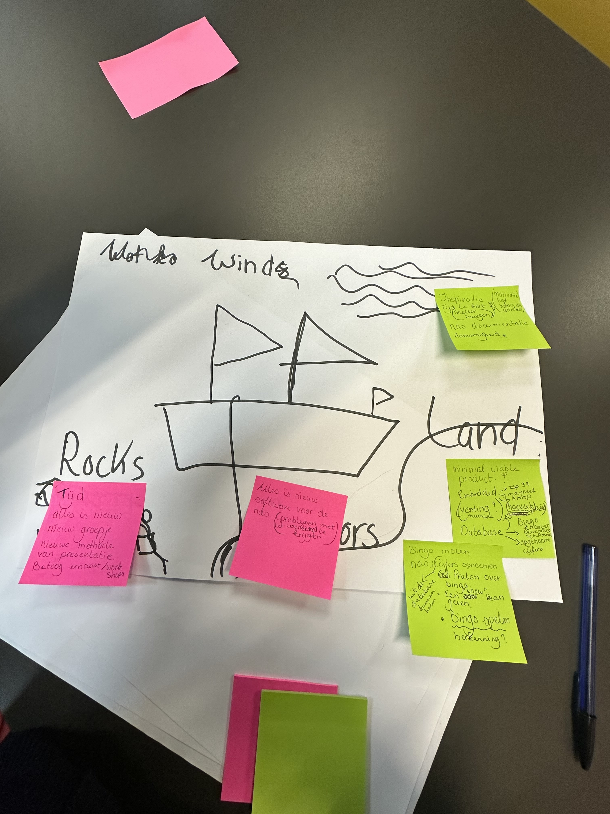

# Sprint Report - Sprint X

**Opdracht**: NAO Robot
**Sprint**: Sprint 1
**Team**: 3
**Auteurs**:  Brian, Tyler, Amin, Tess, Ana
**Datum**:  26-4-2024
**Versie**: v1

---

## Inleiding

**Schrijf hier een inleiding voor het sprint report. Wat is jullie opgevallen tijdens deze sprint?**

Nieuwe methode van werken en hiernaast ook een betoog moeten schrijven. Ook was de manier van sprint review veranderd. Het was ons ook opgevallen dat het project tot nu toe erg soepel verloopt. Iedereen vult elkaar goed aan en we hebben allemaal tijd om onze mening te geven tijdens besluiten. Ook al hebben we niet al te veel tijd gehad deze twee weken.

## Feedback opdrachtgever

**Wat vond de opdrachtgever van wat jullie gepresenteerd hebben tijdens de Sprint Review? Wat waren de positieve punten (tops) en wat waren de verbeterpunten (tips)?**

Het idee en de gedachten achter het idee vond hij leuk, hij had nog veel vragen over de uitvoering qua de raspberry pi, de embedded en waarom we het gebruiken. Kritiek op de database als in dat het onnodig was hoe we het nu wilden gebruiken en dat we daar wat meer in moesten gaan verdiepen. En we moesten kijken naar de implementatie van de embedded en dat we esp 32 gebruiken voor het controllen van de sensoren en actuatoren.

## Sprint behaalde doelen

**Welke User Stories hebben jullie af kunnen ronden tijdens deze sprint? Geef een overzicht.**

Als team hebben we geen user stories volledig af kunnen ronden. Wel hebben we gewerkt aan verschillende User stories.

- Als gebruiker wil ik dat er is onderzocht wat de behoeften zijn van de bewoners van het amstelhuis

Voor deze userstory hebben we een vragenlijst opgesteld die we aan onze doelgroep kunnen stellen. We moeten het onderzoek zelf alleen bijvullen.

- Als gebruiker wil ik dat de robot de balletjes kan oppakken dmv een electromagneet

We zijn bezig geweest met onderzoek naar de electromagneet. Hier moeten we volgende sprint mee verder aangezien we met verkeerde informatie kwamen.

Ook hebben we veel documentatie geschreven over hoe het project in elkaar zit en wat ons doel is.

## User Stories die niet afgerond zijn

**Welke User Stories hebben jullie niet af kunnen ronden tijdens deze sprint? Geef een overzicht, geef ook aan welke aanpassingen jullie hier nog aan moeten maken.**

Ons team heeft deze sprint user stories gemaakt die wij niet hebben kunnen realiseren deze sprint. Dat komt door het de te breed gemaakte stories. We hebben het eerste sprint gebruikt om onderzoek te doen naar onze ideeen en de mogelijkheden die er waren. Deze user stories die niet gehaald zijn hebben ons eerder op weg geholpen als een doel waar we op dat moment onderzoek voor deden.

## Nieuwe User Stories

**Welke nieuwe User Stories hebben jullie opgesteld voor de volgende sprint?**

We hebben een hoop verschillende user stories aangemaakt voor sprint 2. Ook hebben we verschillende user stories aangemaakt voor het project in totaal. hier zijn een aantal daarvan;

- Als een user wil ik van de nao de cijfers horen zodat ik het kan stempelen
- Als gebruiker wil ik dat de esp32 een call ontvangt om een ball los te laten in een bakje
- Als gebruiker wil ik dat de esp32 een call ontvangt om een ball te pakken met behulp van een elektromagneet
- Als gebruiker wil ik dat de robot de bingo-kaart kan controleren
- Als gebruiker wil ik dat de NAO een barcode kan scannen door middel van zijn ogen, zodat de robot bingokaarten kan herkennen

## Prioriteiten

**Wat is belangrijk geweest afgelopen sprint, wat is belangrijk voor de volgende sprint?**

Wat is belangrijk geweest afgelopen sprint, wat is belangrijk voor de volgende sprint?

Afgelopen sprint was het bedenken van een goed en haalbaar idee erg belangrijk. Volgende sprint moeten wij dit idee aanpassen aan de hand van de feedback die wij hebben gekregen. Ook moeten wij ons minimal viable product afmaken.

## Retrospective

**Voeg hier een afbeelding toe van jullie retrospective. Beschrijf wat jullie hebben besproken en wat jullie gaan aanpassen voor de volgende sprint.**

We hebben de zijlboot methode gehandeerd.

Rock:

- weinig tijd
- nieuw groepje
- nieuwe methode van presentaties
- betoog naast project

Anchor:

- nieuw project
- Software NAO (problemen met het werkende krijgen)

Land:

- MVP
- Embedded software (esp32 magneet knop)
- Vending machine
- Database (bingo kaartjes barcodes, opgenoemde cijfers)
- Bingo molen
- NAO moet cijfers opnoemen

Wind:

- Veel inspiratie
- NAO documentatie
- Aanwezigheid
- Veel motivatie

**Wat moet er beter? Wat ging er goed? Welke SMART leerdoelen hebben jullie voor de volgende sprint?**

ieder lid beantwoord deze vragen in zijn scorion formulier.

**Hebben jullie nog vragen?**

-
