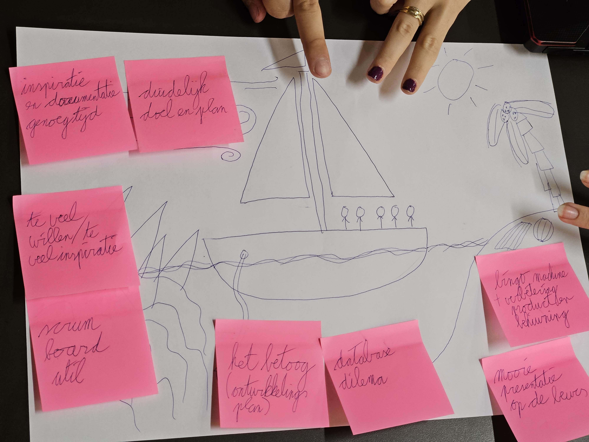

# Sprint Report - Sprint 2

**Opdracht**: NAO Robot
**Sprint**: Sprint 2
**Team**: 3
**Auteurs**:  Brian, Tyler, Amin, Tess, Ana
**Datum**:  24-5-2024
**Versie**: v1

---

## Inleiding

**Schrijf hier een inleiding voor het sprint report. Wat is jullie opgevallen tijdens deze sprint?**

We hebben heel snel heel veel voor elkaar gekregen. Het programmeren van de NAO verloopt goed. En we hebben verschillende verbeteringen gemaakt aan ons productdesign. Het schrijven van een betoog hindert ons uiteindelijk niet zo veel. We hebben ook veel verschillende toevoegingen gemaakt qua embedded hardware.

## Feedback opdrachtgever

**Wat vond de opdrachtgever van wat jullie gepresenteerd hebben tijdens de Sprint Review? Wat waren de positieve punten (tops) en wat waren de verbeterpunten (tips)?**

Het ontwerp moet mooier en meer presentabel. De vending machine moet een "klepje"om de prijs een verassing te maken. Ook moet de NAO meer feestelijk zijn. De rest van het project zag er goed uit. We konden veel presenteren en we hadden een goede demostratie.1

## Sprint behaalde doelen

**Welke User Stories hebben jullie af kunnen ronden tijdens deze sprint? Geef een overzicht.**

- Ik wil QR code herkenning hebben via een laptop camera
- Als gebruiker wil ik dat de robot beweegt zodat ik meer interactie heb ermee
- Als student wil ik leren hoe ik mijn ontwikkeling inzichtelijk maak, zodat ik anderen kan betrekken bij mijn leerproces.
- Als gebruiker wil ik dat ik op een knop kan drukken als ik bingo heb.
- Als gebruiker wil ik dat ik een prijs kan winnen als ik bingo heb
- Als gebruiker wil ik dat er genoeg bingokaarten zijn voor alle spelers
- Als student wil ik leren over ethiek, zodat ik op basis van die kennis bewuste keuzes kan maken
- Als gebruiker wil ik dat de robot de spel bingo kan leiden zodat ik het kan spelen zonder enig probleem

## User Stories die niet afgerond zijn

**Welke User Stories hebben jullie niet af kunnen ronden tijdens deze sprint? Geef een overzicht, geef ook aan welke aanpassingen jullie hier nog aan moeten maken.**

- Als gebruiker wil ik dat de nao robot kan draaien aan de bingomolen
- Als gebruiker wil ik dat de nao robot de barcodes kan onthouden
- Als gebruiker wil ik dat de robot de balletjes kan oppakken dmv een electromagneet
- Als gebruiker wil ik dat er is onderzocht wat de behoeften zijn van de bewoners van het amstelhuis
- Als gebruiker wil ik dat de NAO een show kan geven zodat hij de aandacht van andere kan trekken om bingo te spelen

## Nieuwe User Stories

**Welke nieuwe User Stories hebben jullie opgesteld voor de volgende sprint?**

- Als gebruiker wil ik dat er genoeg bingokaarten zijn voor alle spelers
- Als gebruiker wil ik dat de nao robot kan draaien aan de bingomolen
- Als gebruiker wil ik dat ik op een knop kan drukken als ik bingo heb.

## Prioriteiten

**Wat is belangrijk geweest afgelopen sprint, wat is belangrijk voor de volgende sprint?**

Deze sprint was het belangrijk om alle losse onderdelen werkend te krijgen. De systemen zoals de NAO, database en verschillende ESP's kunnen zo hun taken uitvoeren. Voor volgende sprint is het belangrijk om een MVP te maken.

## Retrospective

**Voeg hier een afbeelding toe van jullie retrospective. Beschrijf wat jullie hebben besproken en wat jullie gaan aanpassen voor de volgende sprint.**

Wind:

- inspiratie en goede documentatie
- genoeg tijd
- duideloijk doel

Anker:

- het betoog en zelfontwikkelingsplan
- database dilema

Rotsen:

- te veel willen
- te veel inspiratie
- scrum board toepassen

Eiland:

- verbeterd product
- behuizing versieren
- mooie presentatie op de beurs

**Wat moet er beter? Wat ging er goed? Welke SMART leerdoelen hebben jullie voor de volgende sprint?**

ieder lid beantwoord deze vragen in zijn scorion formulier.

**Hebben jullie nog vragen?**

-
